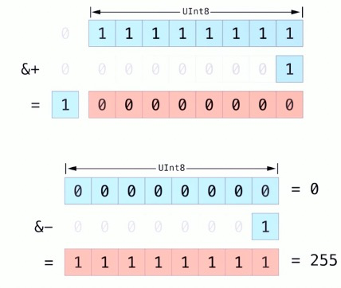
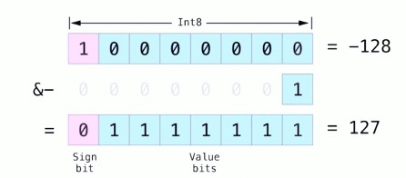

### 溢出算法

- 在默认情况下，当向一个额证书赋超过它容量的值时，Swift会报错而不是生成一个无效的数，给我们操作过大或者过小数的时候提供了额外的安全性
- 同事提供三个算术溢出运算符来让系统支持整数溢出运算：
  - 溢出加法（&+）
  - 溢出减法（&-）
  - 溢出乘法（&*）

### 值溢出

- 数值可以向上溢出或者向下溢出

- 溢出也会发生在有符号整型数值上
- 对于无符号与有符号证书数值来说，当出现上溢时，他们会从证书所能容纳的最大数变成最小的数，同时的，当发生下溢时，它们会从所能容纳的最小数变成最大的数

