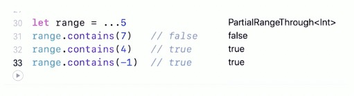

### 闭区间运算符

- 闭区间运算符（a...b）定义了从a到b的一组范围，并且包含a和b。a的值不能大于b。

```swift
for index in 1...5 {
	  print("\(index) times 5 is \(index * 5)")
}
```

### 半开区间运算符

- 半开区间运算符（a..<b），定了从a到b，但不包括b的区间。
- 如同闭区间运算符，a的值也不能大于b，如果a与b的值相等，那返回的区间将会是空的

### 单侧区间

- 闭区间有另外一种形式来让区间朝一个方向尽可能的远，这种区间叫做单侧区间。
- 半开区间运算符同样可以由单侧形式，只需要写它最终的值
- 比如说，一个包含数组所有元素的区间，从索引2到数组的结束。在这种情况下，你可以省略区间运算符一侧的值

```swift
for name in names[2...] {

}

for name in names[...2] {
  
}

for name in names[..<2] {
  
}
```

- 单侧区间可以在其他上下文中使用，不仅仅是下标
- 不能遍历省略了第一个值的单侧区间，因为遍历根本不知道该从哪里始，你可以遍历省略了最终值的单侧区间



### 字符串索引区间

- 字符串范围也可以使用区间运算符

```swift
var welcom = "hello, world"
let range = welcome.index(welcome.endIndex, offsetBy:-6)..<welcom.endIndex)
wwelcom.removeSubrange(range)
```

### 倒序索引

- 通过reversed()方法，我们可以将一个正序循环变成逆序循环

```swift
let range = 0...10
for i in range.reversed() {
    print("\(i)")
}
```


### Comparable区间

- 区间运算符可以作用在Comparable类型上，返回闭区间和半闭区间。

```swift
let welcome = "hello, world"
let interval = "a"..."z"
for c in welcome {
    if !interval.contains(String(c)) {
      	print("\(c) 不是小写字母")
    }
}
```

