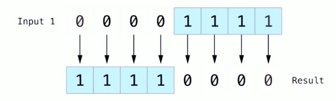
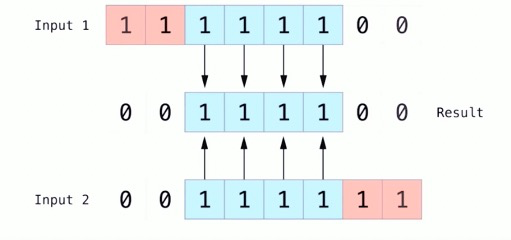
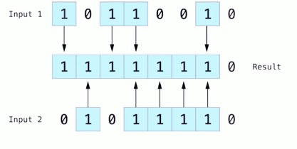
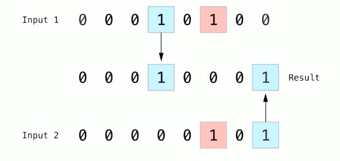
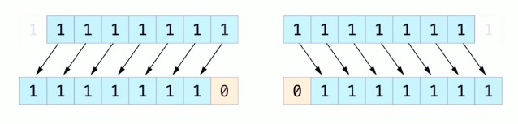
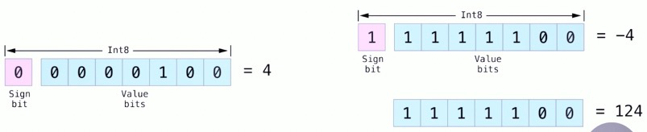
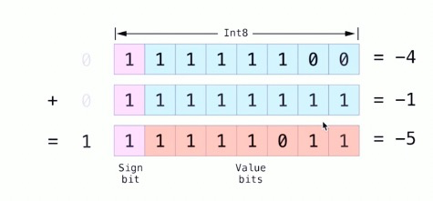
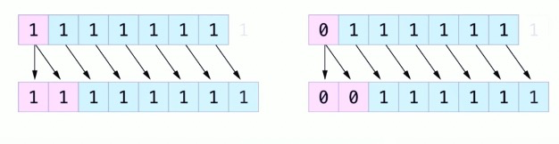
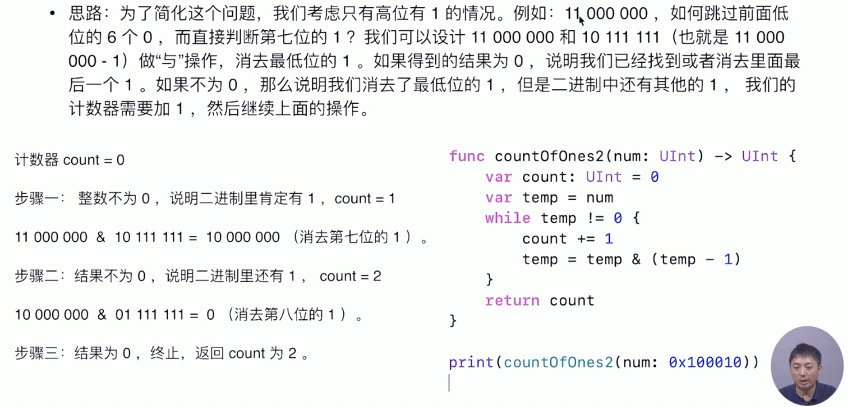

### 位取反运算符

- 位取反运算符（~）是对所有位的数字进行取反操作



### 位与运算符

- 位与运算符（&）可以对两个数的比特位进行合并。它会返回一个新的数，只有当这两个数都是1的时候才会返回1



### 位或运算符

- 位或运算符（|）可以对两个比特位进行比较，然后返回一个新的数，只要两个操作位任意一个为1时，那么对应的位数就为1



### 位异或运算符

- 位异或运算符，或者说“互斥或”（^）可以对两个数的比特位进行比较。它返回一个新的数，当两个操作数的对应位不相同时，该数的对应位就为1



### 位左移和右移运算符

- 位左移运算符（<<）和位右移运算符（>>）可以把所有位数向左或向右移动到一个确定的位数
- 位左移和右移具有给整数乘以或除以二的效果。讲一个数左移一位相当于把这个数翻倍，讲一个数右移一位相当于把这个数减半。

### 无符号整数的位移操作

- 已经存在的比特位按指定的位数进行左移和右移
- 任何移动超出整型存储边界的位都会被丢弃
- 用0两填充向左或向右产生的空白位



### 有符号整数的移位操作

- 有符号整数使用它的第一位（所谓的符号位）来表示整个整数是正数还是负数。符号位为0表示为正数，1表示为负数
- 其余的位数（所谓的数值位）存储了实际的值。有符号正整数和无符号的存储方式是一样的，都是从0开始算起
- 但是负数的存储方式略有不。它存储的是2的n次方减去它的绝对值，这里的n为整数位的位数。



### 补码表示的优点

- 首先，如果想给-4加个-1，只需要将这两个数的全部八个比特位相加（包括符号位），并且将计算结果中超出的部分丢弃



- 其次，使用二进制补码可以使负数的位左移和右移操作得到跟证书相同的效果，即每向左移一位就将自身的数值乘以2，每向右移一位就将自身的数值除以2.要达到此目的，对有符号整数的右移有一个额外的规则：当对整数进行位右移操作时，遵循与无符号整数相同的规则，但是对于位移产生的空白位使用符号位进行填充，而不是0.



### 两个数字交换

- 不借助临时变量，交换两个变量的值

```swift
var a = 10
var b = 8
a = a ^ b
b = a ^ b
a = a ^ b
```

### 求无符号整数二进制中1的个数

- 思路：看一个八位整数10100001，先判断最后一位是否为1，而与操作可以达到目的。可以把这个八位数与00000001进行与操作。如果结果为1，则表示当前八位数的最后一位是1，否则为0，

```swift
func countOfOnes(num: UInt) -> UInt {
  	var count: UInt = 0
  	var temp = num
  	while temp != 0 {
      	count += temp & 1
      	temp = temp >> 1
    }
  
  	return count
}
```

- 如果整数的二进制中有较多的0，那么我们每一次右移一位做判断会很浪费，怎么改进前面的算法，有没有办法让算法的复杂度只与“1”的个数有关？



### 引申：如何判断一个整数为2的整数次幂

- 给定一个无符号整型量，判断是否为2的整数次幂
- 思路：一个整数如果是2的整数次方，那么它的二进制表示中有且只有一位是 1，而其他所有位都是0.根据前面的分析，把这个整数减去1后再和它自己做与运算，这个整数中唯一的1就变成了0，也就是得到的结果为0.

```swift
func isPowerOfTwo(num: UInt) -> Bool {
    return (num & (num - 1)) == 0
}
```


