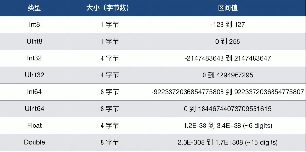

### 整数

- Swift提供了8，16，32和64位编码的有符号和无符号整数
- 命名方式：例如8位无符号整数的类型是UInt8，32位有符号整数的类型是Int32
- 通过min和max属性来访问每个整数类型的最小值和最大值
- Swift提供了一个额外的整数类型：Int，它拥有与当前平台的原生字相同的长度
- 同时Swift也提供UInt类型，来表示平台长度相关的无符号整数
- 建议在用到整数的地方都使用Int

### 浮点数

- Double：64位浮点数，至少有15位数字的精度
- Float：32位浮点数，至少有6位数字的精度
- 在两种类型都可以的情况下，推荐使用Double类型

### 数值范围



### Bool

- Bool：true 和 false
- Swift的类型安全机制会阻止你用一个非布尔量的值替换掉Bool

### 类型别名

- 类型别名是一个为已存在类型定义一个可选择的名字
- 你可以关键字typealias定义一个类型的别名
- 当你想通过在一个在上下文中看起来更合适可具有代表性的名字来引用一个已存在的类型时，这时别名就非常有用了

```swift
typealias AudioSample = UInt8
let sample: AudioSample  = 8
```

