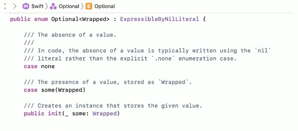

### Optional实现探究

- Optional其实是标准库里的一个enum类型
- 用标准库实现语言特性的典型



### Optional 实现探究

- Optional.none 就是nil
- Optional.some 则包装了实际的值

```swift
var str: Optional<String> = "abc" // 跟 String? 定义出来的
if let actualStr = str {
  let count = actualStr.count
  print(count)
}
```

### Optional 展开实现

- 泛型属性unsafelyUnwrapped
- 理论上我们可以直接调用unsafelyUnwrapped获取可选值的值

```swift
var str: String? = "abc"
let count = str.unsafelyUnwrapped.count
print(count)
```

