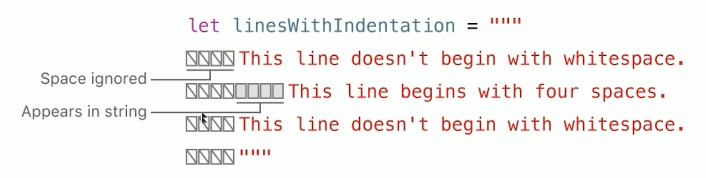
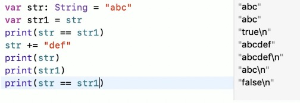
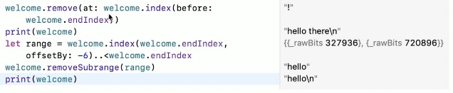

### 初始化空串

- 字面量
- 初始化器语法
- isEmpty检查是否为空串

```swift
var emptyString = ""
var anotherEmptyString = Sting()

if emptyString.isEmpty {
  print("Nothing to see here")
}
```

### 字面量

- 字符串字面量是被双引号（“”）包裹的固定顺序文本字符
- Swift会为str常量推断为String

```swift
let str = "some string"
```

### 多行字面量

- 多行字符串字面量是用三个双引号引起来的一系列字符
- 多行字符串字面量把所有行包括在引号内，开始和结束默认不会有换行符
- 当你的代码中在多行字符串字面量里包含了换行，那个换行符同样会成为字符串里的值。如果你想要使用换行符来让你的代码易读，却不想让黄航服成为字符串的值，那就在那些行的末尾使用反斜杠（\）
- 要让多行字符串字面量起始或结束于换行，就在第一或最后一行写一个空行
- 多行字符串可以缩进以匹配周围的代码。双引号钱的空格会告诉swift其他行前应该有多少空白是需要忽略的
- 如果你再某行的空格超过了结束的双引号，那么这些空格会被包含



### 字符串里的特殊字符

- 转义特殊字符\0（空字符）,\\\\（反斜杠），\t（水平制表符），\n（换行符），\r（回车符），\\"（双引号）以及\\'（单引号）
- 任意的Unicode标量，写作\u{n}，里边的n是一个1-8位的16进制数字，其值是合法的Unicode值
- 可以在多行字符串字面量中包含双引号(")而不需要转义。要在多行字符串中包含文本""",转义至少一个双引号

### 扩展字符串分隔符

- 在字符串字面量中防止扩展分隔符来在字符串中包含特殊字符而不让他们真的生效
- 把字符串放在双引号（"）内并由井号（#）包裹
- 如果字符串里有"#则首尾需要两个##
- 如果你需要字符串中某个特殊符号的效果，使用匹配你包裹的#号并在清明写转义符号\

### 字符串的可变性

- var指定的可以修改
- let指定的不可以修改

### 字符串是值类型

- String值在传递给方法或者函数的时候会被复制过去
- 赋值给常量或者变量的时候也是一样
- Swift编译器优化了字符串使用的资源，实际上拷贝只会在确实需要的时候才进行



### 操作字符

- for-in循环遍历String中的每一个独立的Character
- Character类型
- String值可以通过传入Character数组来构造

### 字符串的拼接

- 使用加运算符（+）创建新字符串
- 使用加赋值符号（+=）在已经存在的String值末尾追加一个Sting值
- 使用String类型的append()方法来可以给一个String变量的末尾追加Character值

### 字符串插值

- 字符串插值是一种从混合常量、变量、字面量和表达式的字符串字面量构造新String值的方法
- 每一个你插入到字符串字面量的元素都被一对圆括号包裹，然后使用反斜杠前缀
- 类似于NSString的stringWithFormmat方法，但是更加简单，更强大
- 可以在扩展字符串分隔符中创建一个包含在其他情况下会被当做字符串插值的字符
- 要在使用扩展分隔符的字符串中使用字符串插值，在反斜杠首尾使用#号数量的#号

### 字符串索引

- 每一个String值都有相关的索引类型，String Index，它相当于每个Character在字符串中的位置
- startIndex属性来访问String中第一个Character的位置。endIndex属性就是String中最后一个字符后的位置
- endIndex属性并不是字符串下标脚本的合法实际参数
- 如果String为nil，则startIndex 与 endIndex相等
- 使用index(before:) 和 index(after:)方法来访问给定索引的前后
- 要访问给定索引更远的索引，你可以使用index(_:offsetBy:)
- 使用indices属性来访问字符串中每个字符的索引

```swift
let greeting = "Guten Tag!"
greeting[greeting.startIndex]
greeting[greeting.index(before: greeting.endIndex)]
greeting[greeting.index(after: greeting.startIndex)]

let index = greeting.index(greeting.startIndex, offsetBy: 7)
greeting[index]
```

### 插入

- 插入字符，使用insert(_: at:) 方法
- 插入另一个字符串的内容到特定的索引，使用insert(contentsOf: at:)方法

```swift
var welcome = "hello"
welcome.insert("!", at: wecome.endIndex)

wecome.insert(contentsOf: " there", at: welcome.index(before: welcome.endIndex))
```

### 删除

- 移除字符，使用remove(at:)方法
- 移除一小段特定范围的字符串，使用removeSubrange(_:)方法



### 子字符串

- 使用下标或者类似prefix(_:)的方法得到的子字符串是Sbustring类型
- Substring拥有String的大部分方法
- Substring可以转成String类型

```swift
let greeting = "Hello, world!"
let index = greeting.index(of: ",") ?? greeting.endIndex
let beginning = greeting[..<index]
let newString = Sting(beginning)
```

- 子字符串重用一部分原字符串的内存
- 修改字符串或者子字符串之前都不需要会费拷贝内存的代价
- Sting 和 Sbustring都遵循StingProtocol协议，也就是说它基本上能很方便地兼容所有接受StringProtocol值的字符串操作函数

### 字符串比较

- 字符串和字符相等性（==和!=）
- 前缀相等hasPrefix(_:)
- 后缀相等hasSuffix(_:)


