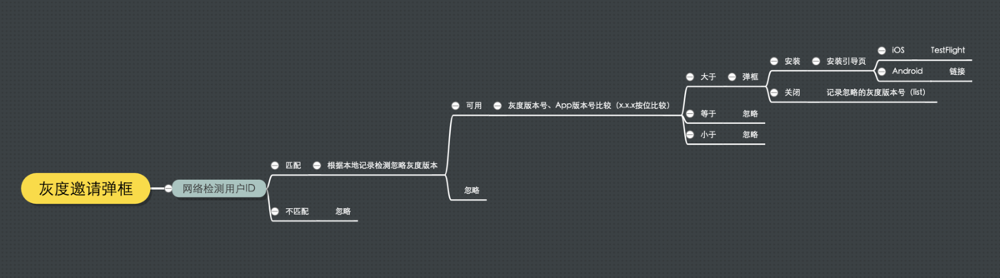
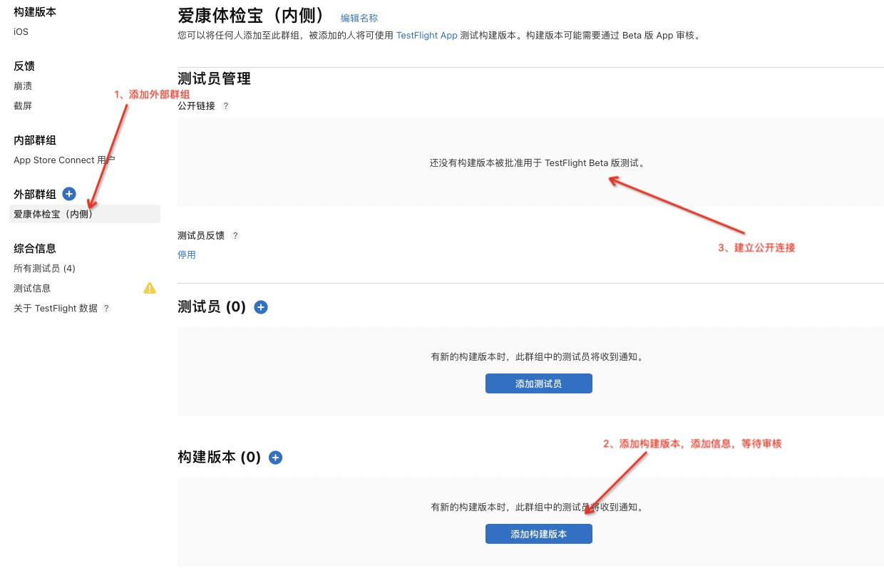

### TestFlight

- 需要运行在iOS8及以上版本设备上
- 需要安装TestFlight App
- 有效时间（90天）
- 测试人员有最大上限（最多10000）
- TestFlight版本，可以反馈，需要审核（1天左右）
- TestFlight版本，可以生成公开链接，并且可以修改公开链接用于安装（[https://testflight.apple.com/join/xxxxxx](https://links.jianshu.com/go?to=https%3A%2F%2Ftestflight.apple.com%2Fjoin%2Fxxxxxx)），安装链接（[itms-beta://testflight.apple.com/join/xxxxxx](https://links.jianshu.com/go?to=itms-beta%3A%2F%2Ftestflight.apple.com%2Fjoin%2Fxxxxxx)）

整体灰度发布的思路：



该流程特点：

1. 可以根据用户id判断用户是否满足我们要发布版本的对象用户
2. 需要判断用户手机是否安装testFlight，否则无法安装testFlight测试版本

该灰度发布实现完全没有使用苹果官方提供的分阶段发布，而是结合testFlight测试版本来实现的。10000安装使用数量，一定程度上已经满足版本的各种测试。

该策略实现的灰度发布，也有些弊端。比如，**安装testflight测试版本出现问题，也无法版本回滚，只有在发布新的更正版本后才能避免bug。**但是在声名“内测”版本，并且安装用户数量在10000以内情况，这种更具有针对性的灰度发布还是很有优势的。



```objective-c
    CGFloat systemVersion = [[[UIDevice currentDevice] systemVersion] floatValue];
    NSURL* invitationpURL = [NSURL URLWithString:@"邀请链接"];
    if (systemVersion>=10.0)
    {
        /*@{UIApplicationOpenURLOptionUniversalLinksOnly : @NO}
         YES: App不存在时，不使用Safari对应的链接
         NO: App不存在时，使用Safari对应的链接
         */
        [[UIApplication sharedApplication] openURL:invitationpURL options:@{UIApplicationOpenURLOptionUniversalLinksOnly : @YES} completionHandler:^(BOOL success) {

        }];
    }else {
        //忽略警告  -Wdeprecated-declarations：警告的类型
#pragma clang diagnostic push
#pragma clang diagnostic ignored "-Wdeprecated-declarations"
        //当TestFlight 不存在时，使用Safari对应的链接
        [[UIApplication sharedApplication] openURL:invitationpURL];
#pragma clang diagnostic pop
    }
```

