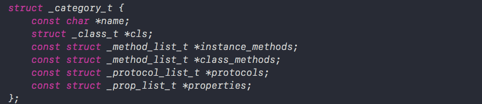
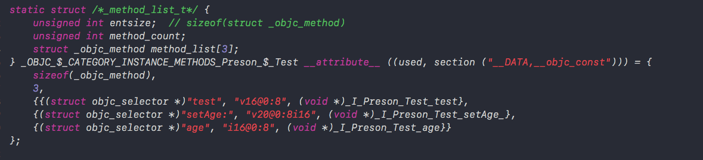
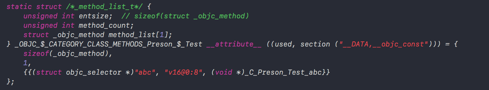
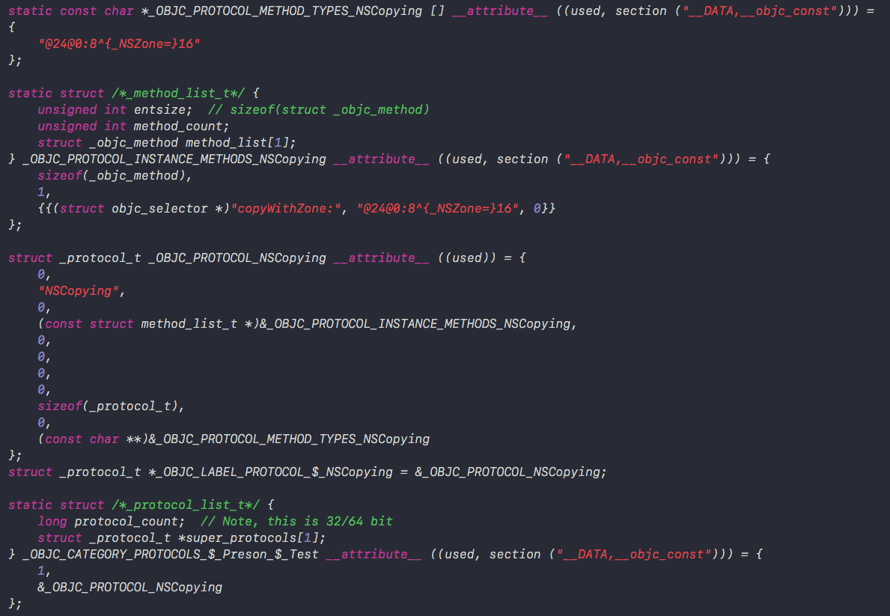
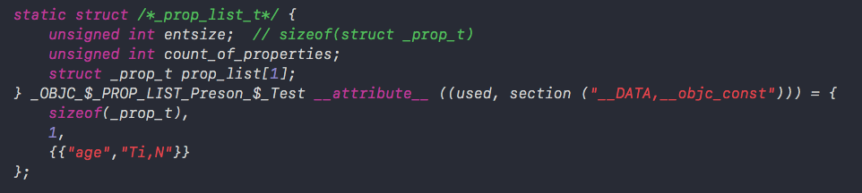

```
xcrun -sdk iphoneos clang -arch arm64 -rewrite-objc Preson+Test.m
```

分类中的对象方法依然是存储在类对象中的，同对象方法在同一个地方，那么调用步骤也同对象方法一样。如果是类方法的话，也同样是存储在元类对象中。

### 分类的底层结构

```objective-c
struct category_t {
    const char *name;
    classref_t cls; // 类名
    struct method_list_t *instanceMethods; // 对象方法
    struct method_list_t *classMethods; // 类方法
    struct protocol_list_t *protocols; // 协议
    struct property_list_t *instanceProperties; // 属性
    // Fields below this point are not always present on disk.
    struct property_list_t *_classProperties;

    method_list_t *methodsForMeta(bool isMeta) {
        if (isMeta) return classMethods;
        else return instanceMethods;
    }

    property_list_t *propertiesForMeta(bool isMeta, struct header_info *hi);
};
```




实例方法列表：



类对象方法列表：



存储着方法占用的内存，方法数量，以及方法列表

协议方法列表：



分别为protocol_count 协议数量以及存储了协议方法的_protocol_t结构体

属性列表：



