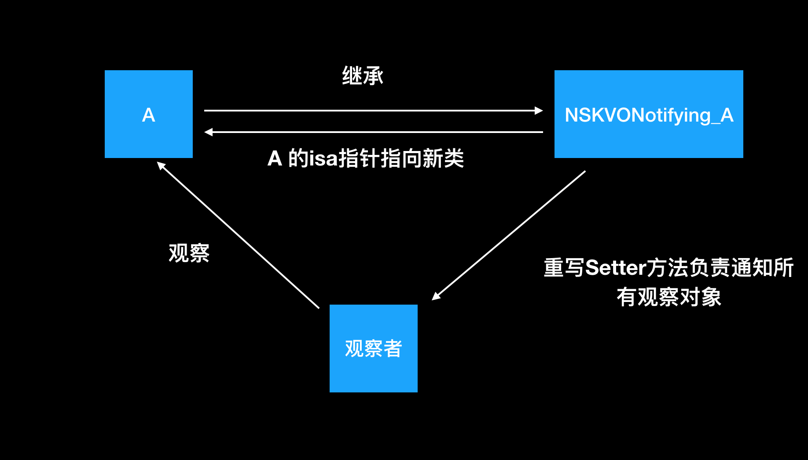
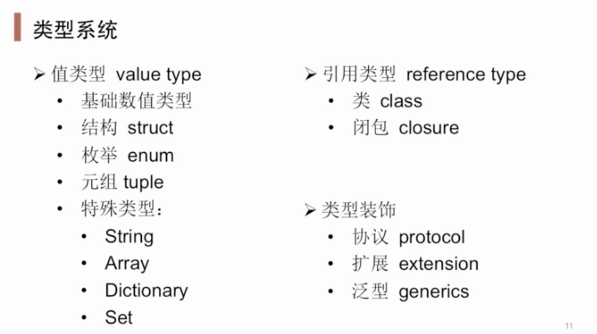

### 1.继承、分类、扩展

Category（分类） 
Extension（扩展） 
Inheritance (继承)

```
答：
1. 分类有名字，类扩展没有分类名字，是一种特殊的分类。
2. 分类只能扩展方法（属性仅仅是声明，并没真正实现，因为在运行期，对象的内存布局已经确定，如果添加实例变量就会破坏类的内部布局，这对编译型语言来说是灾难性的），类扩展一般用于声明私有方法，私有属性，私有成员变量。
3. 继承可以增加，修改或者删除方法，并且可以增加属性。

复制代码
```

[OC温故:类的三大特性(封装，继承，多态)](http://www.cocoachina.com/articles/10609)

[iOS中Category和Extension 原理详解](https://blog.csdn.net/u013602835/article/details/80918042)

[iOS 成员变量 / 实例变量 / 属性变量](https://www.jianshu.com/p/31fae4d81607) 


### 2.Objective-C的类可以多重继承么？可以实现多个接口么？Category是什么？重写一个类的方式用继承好还是分类好？为什么不要在category中重写一个类原有的方法？

```
答：
Objective-c的类不可以有多继承，OC里面都是单继承，多继承可以用protocol委托代理来模拟实现
可以实现多个接口，可以通过实现多个接口完成OC的多重继承

Category是分类；

⚠️重写一个类的方式用继承好还是分类好：
重写一个类的方式用继承还是分类.取决于具体情况.假如目标类有许多的子类.我们需要拓展这个类又不希望影响到原有的代码.继承后比较好.
如果仅仅是拓展方法.分类更好.（不需要涉及到原先的代码）

分类中方法的优先级比原来类中的方法高，也就是说，在分类中重写了原来类中的方法，那么分类中的方法会覆盖原来类中的方法


⚠️为什么不要在category中重写一个类原有的方法：
1、category没有办法去代替子类，它不能像子类一样通过super去调用父类的方法实现。如果category中重写覆盖了当前类中的某个方法，那么这个当前类中的原始方法实现，将永远不会被执行，这在某些方法里是致命的。(ps:这里提一下，+(void)load方法是一个特例，它会在当前类执行完之后再在category中执行。)
2、同时，一个category也不能可靠的覆盖另一个category中相同的类的相同的方法。例如UIViewController+A与UIViewController+B，都重写了viewDidLoad，我们就无法控制谁覆盖了谁。
3、通过观察头文件我们可以发现，Cocoa框架中的许多类都是通过category来实现功能的，可能不经意间你就覆盖了这些方法中的其一，有时候就会产生一些无法排查的异常原因。
4、category的诞生只是为了让开发者更加方便的去拓展一个类，它的初衷并不是让你去改变一个类。
结论：
要重写方法，当然我们首推通过子类重写父类的方法，在一些不方便重写的情况下，我们也可以在category中用runtime进行method swizzling(方法的偷梁换柱)来实现。
复制代码
```


### 3.什么是多态?什么是分类?什么是协议?

```
答：
多态在面向对象语言中指同一个接口有多种不同的实现方式,在OC中,多态则是不同对象对同一消息的不同响应方式;子类通过重写父类的方法来改变同一方法的实现.体现多态性
通俗来讲: 多态就父类类型的指针指向子类的对象,在函数（方法）调用的时候可以调用到正确版本的函数（方法）。
多态就是某一类事物的多种形态.继承是多态的前提;

复制代码
答：
分类: 在不修改原有类代码的情况下,可以给类添加方法
Categroy 给类扩展方法,或者关联属性, Categroy底层结构也是一个结构体:内部存储这结构体的名字,那个类的分类,以及对象和类方法列表,协议,属性信息
通过Runtime加载某个类的所有Category数据
把所有Category的方法、属性、协议数据，合并到一个大数组中后面参与编译的Category数据，会在数组的前面
将合并后的分类数据（方法、属性、协议），插入到类原来数据的前面

复制代码
答：
协议：协议是一套标准，这个标准中声明了很多方法，但是不关心具体这些方法是怎么实现的，具体实现是由遵循这个协议的类去完成的。
在OC中，一个类可以实现多个协议，通过协议可以弥补单继承的缺陷但是协议跟继承不一样，协议只是一个方法列表，方法的实现得靠遵循这个协议的类去实现。
复制代码
```


### 4.请说明并比较以下关键词：strong, weak, assign, copy。

```
答：
* strong表示指向并拥有该对象。其修饰的对象引用计数会增加1。该对象只要引用计数不为0则不会被销毁。当然强行将其设为nil可以销毁它。
* weak表示指向但不拥有该对象。其修饰的对象引用计数不会增加。无需手动设置，该对象会自行在内存中销毁。
* assign主要用于修饰基本数据类型，如NSInteger和CGFloat，这些数值主要存在于栈上。
* weak 一般用来修饰对象，assign一般用来修饰基本数据类型。原因是assign修饰的对象被释放后，指针的地址依然存在，造成野指针，在堆上容易造成崩溃。而栈上的内存系统会自动处理，不会造成野指针。
* copy与strong类似。不同之处是strong的复制是多个指针指向同一个地址，而copy的复制每次会在内存中拷贝一份对象，指针指向不同地址。copy一般用在修饰有可变对应类型的不可变对象上，如NSString, NSArray, NSDictionary。
* Objective-C 中，基本数据类型的默认关键字是atomic, readwrite, assign；普通属性的默认关键字是atomic, readwrite, strong。

复制代码
```


### 5.用@property声明的 NSString / NSArray / NSDictionary 经常使用 copy 关键字，为什么？如果改用strong关键字，可能造成什么问题？

```
答：
用 @property 声明 NSString、NSArray、NSDictionary 经常使用 copy 关键字，是因为他们有对应的可变类型：NSMutableString、NSMutableArray、NSMutableDictionary，他们之间可能进行赋值操作（就是把可变的赋值给不可变的），为确保对象中的字符串值不会无意间变动，应该在设置新属性值时拷贝一份。
1. 因为父类指针可以指向子类对象,使用 copy 的目的是为了让本对象的属性不受外界影响,使用 copy 无论给我传入是一个可变对象还是不可对象,我本身持有的就是一个不可变的副本。
2. 如果我们使用是 strong ,那么这个属性就有可能指向一个可变对象,如果这个可变对象在外部被修改了,那么会影响该属性。
//总结：使用copy的目的是，防止把可变类型的对象赋值给不可变类型的对象时，可变类型对象的值发送变化会无意间篡改不可变类型对象原来的值。

复制代码
```

[理解iOS中深浅拷贝-为什么NSString使用copy](https://www.jianshu.com/p/eda4957735ee) 


### 6.浅拷贝和深拷贝的区别？

```
答：
浅拷贝：只复制指向对象的指针，而不复制引用对象本身。
深拷贝：复制引用对象本身。内存中存在了两份独立对象本身，当修改A时，A_copy不变。

复制代码
```

[详解iOS的深浅拷贝](https://www.jianshu.com/p/afca814fba36) 


### 7.Objective-C 如何对内存管理的，说说你的看法和解决方法？

```
答：Objective-C的内存管理主要有三种方式ARC(自动内存计数)、手动内存计数、内存池。
1). 自动内存计数ARC：由Xcode自动在App编译阶段，在代码中添加内存管理代码。
2). 手动内存计数MRC：遵循内存谁申请、谁释放；谁添加，谁释放的原则。
3). 内存释放池Release Pool：把需要释放的内存统一放在一个池子中，当池子被抽干后(drain)，池子中所有的内存空间也被自动释放掉。内存池的释放操作分为自动和手动。自动释放受runloop机制影响。
复制代码
```


### 8.我们说的OC是动态运行时语言是什么意思？

```
答：
主要是将数据类型的确定由编译时，推迟到了运行时。简单来说, 运行时机制使我们直到运行时才去决定一个对象的类别,以及调用该类别对象指定方法。

复制代码
```


### 9.什么是 KVO 和 KVC？谈谈 KVC 以及 KVO 的理解？

```
答：
KVC(key-value-coding)键值编码，是一种间接访问实例变量的方法。提供一种机制来间接访问对象的属性。
1、给私有变量赋值。
2、给控件的内部属性赋值（如自定义UITextFiled的clearButton，或placeholder的颜色，一般可利用runtime获取控件的内部属性名，Ivar *ivar = class_getInstanceVariable获取实例成员变量）。
[textField setValue:[UIColor redColor] forKeyPath:@"placeholderLabel.textColor"];
3、结合Runtime，model和字典的转换（setValuesForKeysWithDictionary，class_copyIvarList获取指定类的Ivar成员列表）


KVO是一种基于KVC实现的观察者模式。当指定的被观察的对象的属性更改了，KVO会以自动或手动方式通知观察者。
事例：监听 ScrollView 的 contentOffSet属性
[scrollview addObserver:self forKeyPath:@"contentOffset"  options:NSKeyValueObservingOptionNew context:nil];

复制代码
```

[KVO图](https://user-gold-cdn.xitu.io/2019/9/25/16d67d070bee8cb7?imageView2/0/w/1280/h/960/ignore-error/1)


### 10.block的注意点

```
答：
1. 在block内部使用外部指针且会造成循环引用情况下，需要用__weak修饰外部指针：
    __weak typeof(self) weakSelf = self; 
2. 在block内部如果调用了延时函数还使用弱指针会取不到该指针，因为已经被销毁了，需要在block内部再将弱指针重新强引用一下。
    __strong typeof(self) strongSelf = weakSelf;
3. 如果需要在block内部改变外部栈区变量的话，需要在用__block修饰外部变量。

复制代码
```


### 11.堆、栈和队列

```
答：
1.从管理方式来讲
对于栈来讲，是由编译器自动管理，无需我们手工控制；
对于堆来说，释放工作由程序员控制，容易产生内存泄露(memory leak)
2.从申请大小大小方面讲
栈空间比较小
堆控件比较大
3.从数据存储方面来讲
栈空间中一般存储基本类型，对象的地址
堆空间一般存放对象本身，block的copy等
复制代码
答：
# 堆
堆是一种经过排序的树形数据结构，每个节点都有一个值，通常我们所说的堆的数据结构是指二叉树。所以堆在数据结构中通常可以被看做是一棵树的数组对象。而且堆需要满足一下两个性质：

1）堆中某个节点的值总是不大于或不小于其父节点的值；

2）堆总是一棵完全二叉树。

堆分为两种情况，有最大堆和最小堆。将根节点最大的堆叫做最大堆或大根堆，根节点最小的堆叫做最小堆或小根堆，在一个摆放好元素的最小堆中，父结点中的元素一定比子结点的元素要小，但对于左右结点的大小则没有规定谁大谁小。

堆常用来实现优先队列，堆的存取是随意的，这就如同我们在图书馆的书架上取书，虽然书的摆放是有顺序的，但是我们想取任意一本时不必像栈一样，先取出前面所有的书，书架这种机制不同于箱子，我们可以直接取出我们想要的书。

# 栈
栈是限定仅在表尾进行插入和删除操作的线性表。我们把允许插入和删除的一端称为栈顶，另一端称为栈底，不含任何数据元素的栈称为空栈。栈的特殊之处在于它限制了这个线性表的插入和删除位置，它始终只在栈顶进行。

栈是一种具有后进先出的数据结构，又称为后进先出的线性表，简称 LIFO（Last In First Out）结构。也就是说后存放的先取，先存放的后取，这就类似于我们要在取放在箱子底部的东西（放进去比较早的物体），我们首先要移开压在它上面的物体（放进去比较晚的物体）。

堆栈中定义了一些操作。两个最重要的是PUSH和POP。PUSH操作在堆栈的顶部加入一个元素。POP操作相反，在堆栈顶部移去一个元素，并将堆栈的大小减一。

栈的应用—递归

# 队列
队列是只允许在一端进行插入操作、而在另一端进行删除操作的线性表。允许插入的一端称为队尾，允许删除的一端称为队头。它是一种特殊的线性表，特殊之处在于它只允许在表的前端进行删除操作，而在表的后端进行插入操作，和栈一样，队列是一种操作受限制的线性表。

队列是一种先进先出的数据结构，又称为先进先出的线性表，简称 FIFO（First In First Out）结构。也就是说先放的先取，后放的后取，就如同行李过安检的时候，先放进去的行李在另一端总是先出来，后放入的行李会在最后面出来。

复制代码
```


### 12.UIView 和 CALayer 是什么关系？

```
答：
UIView 继承 UIResponder，而 UIResponder 是响应者对象，可以对iOS 中的事件响应及传递，CALayer 没有继承自 UIResponder，所以 CALayer 不具备响应处理事件的能力。CALayer 是 QuartzCore 中的类，是一个比较底层的用来绘制内容的类，用来绘制UI

UIView 对 CALayer 封装属性，对 UIView 设置 frame、center、bounds 等位置信息时，其实都是UIView 对 CALayer 进一层封装，使得我们可以很方便地设置控件的位置；例如圆角、阴影等属性， UIView 就没有进一步封装，所以我们还是需要去设置 Layer 的属性来实现功能。

UIView 是 CALayer 的代理，UIView 持有一个 CALayer 的属性，并且是该属性的代理，用来提供一些 CALayer 行的数据，例如动画和绘制。

复制代码
```


### 13.说一下 JS 和 OC 互相调用的几种方式？

```
答：
js调用oc的三种方式:

方式一:通过替换js中的function(方法)
方式二:通过注入对象,直接调用对象方法
方式三:利用网页重定向,截取字符串.

oc调用js代码两种方式

1.通过webVIew调用 webView stringByEvaluatingJavaScriptFromString: 调用
2.通过JSContext调用[context evaluateScript:];

复制代码
```


### 14.如何理解HTTP?/Http 和 Https 的区别？Https为什么更加安全？

```
答：
HTTP本质上是一种协议，全称是Hypertext Transfer Protocol，即超文本传输协议。HTTP是一个基于TCP/IP通信协议来传递数据, 该协议用于规定客户端与服务端之间的传输规则，所传输的内容不局限于文本(其实可以传输任意类型的数据)。

一次HTTP可以看做是一个事务,其工作过程分为4步:

1.客户端与服务器建立连接
2.建立连接后,客户端给服务端发送请求
3.服务器收到消息后,给与响应操作
4.客户端收到消息后,展示到屏幕上,断开连接.

复制代码
答：
区别

1.HTTPS 需要向机构申请 CA 证书，极少免费。

2.HTTP 属于明文传输，HTTPS基于 SSL 进行加密传输。

3.HTTP 端口号为 80，HTTPS 端口号为 443 。

4.HTTPS 是加密传输，有身份验证的环节，更加安全。

安全

SSL(安全套接层) TLS(传输层安全)

以上两者在传输层之上，对网络连接进行加密处理，保障数据的完整性，更加的安全。

复制代码
```


### 15.编程中的六大设计原则？

```
答：
1.单一职责原则

通俗地讲就是一个类只做一件事

CALayer：动画和视图的显示。

UIView：只负责事件传递、事件响应。

2.开闭原则

对修改关闭，对扩展开放。 要考虑到后续的扩展性，而不是在原有的基础上来回修改

3.接口隔离原则

使用多个专门的协议、而不是一个庞大臃肿的协议，如 UITableviewDelegate + UITableViewDataSource

4.依赖倒置原则

抽象不应该依赖于具体实现、具体实现可以依赖于抽象。 调用接口感觉不到内部是如何操作的

5.里氏替换原则

父类可以被子类无缝替换，且原有的功能不受任何影响 如：KVO

6.迪米特法则

一个对象应当对其他对象尽可能少的了解，实现高聚合、低耦合

复制代码
```


### 17.沙盒目录结构是怎样的？各自用于那些场景？

```
答：
Application：存放程序源文件，上架前经过数字签名，上架后不可修改
Documents：常用目录，iCloud备份目录，存放数据
Library
Caches：存放体积大又不需要备份的数据
Preference：设置目录，iCloud会备份设置信息
tmp：存放临时文件，不会被备份，而且这个文件下的数据有可能随时被清除的可能
复制代码
```


### 17.iOS中数据持久化方案有哪些？

```
答：
NSUserDefault 简单数据快速读写
Property list (属性列表)文件存储
Archiver (归档)
SQLite 本地数据库
CoreData（是iOS5之后才出现的一个框架，本质上是对SQLite的一个封装，它提供了对象-关系映射(ORM)的功能，即能够将OC对象转化成数据，保存在SQLite数据库文件中，也能够将保存在数据库中的数据还原成OC对象，通过CoreData管理应用程序的数据模型）
复制代码
```


### 18.单个viewController的生命周期？

```
答：
- initWithCoder:(NSCoder *)aDecoder：（如果使用storyboard或者xib）
- loadView：加载view
- viewDidLoad：view加载完毕
- viewWillAppear：控制器的view将要显示
- viewWillLayoutSubviews：控制器的view将要布局子控件
- viewDidLayoutSubviews：控制器的view布局子控件完成  
- viewDidAppear:控制器的view完全显示
- viewWillDisappear：控制器的view即将消失的时候
- viewDidDisappear：控制器的view完全消失的时候
- dealloc 控制器销毁
复制代码
```


### 19.cocoa 和 cocoa touch是什么?/cocoa touch底层技术架构?

```
答：
Cocoa包含Foundation和AppKit框架，可用于开发Mac OS X系统的应用程序。
Cocoa Touch包含Foundation和UIKit框架，可用于开发iPhone OS系统的应用程序。
Cocoa是 Mac OS X 的开发环境，Cocoa Touch是 iPhone OS的开发环境。
复制代码
答：
cocoa touch底层技术架构 主要分为4层:

可触摸层 Cocoa Touch : UI组件,触摸事件和事件驱动,系统接口
媒体层 Media: 音视频播放,动画,2D和3D图形
Core Server: 核心服务层,底层特性,文件,网络,位置服务区等
Core OS: 内存管理,底层网络,硬盘管理
复制代码
```


### 20. 如何选择delegate、notification、KVO？

```
答：
三种模式都是一个对象传递事件给另外一个对象，并且不要他们有耦合。

delegate. 一对一
notification 一对多,多对多
KVO 一对一
三者各有自己的特点:

delegate 语法简洁,方便阅读,易于调试
notification 灵活多变,可以跨越多个类之间进行使用
KVO 实现属性监听,实现model和view同步
可以根据实际开发遇到的场景来使用不同的方式

复制代码
```


### 21.平时开发有没有玩过 Instrument ？

```
答：
Instruments里面工具很多，常用的有：
(1).Time Profiler：性能分析,用来检测应用CPU的使用情况.可以看到应用程序中各个方法正在消耗CPU时间。
(2).Zoombies：检查是否访问了僵尸对象，但是这个工具只能从上往下检查，不智能
(3).Allocations：用来检查内存，写算法的那批人也用这个来检查
(4).Leaks：检查内存，看是否有内存泄漏
(5).Core Animation：评估图形性能，这个选项检查了图片是否被缩放，以及像素是否对齐。被放缩的图片会被标记为黄色，像素不对齐则会标注为紫色。黄色、紫色越多，性能越差。

复制代码
```


### 常用的排序算法

```
答：
选择排序、冒泡排序、插入排序三种排序算法可以总结为如下：

都将数组分为已排序部分和未排序部分。

选择排序将已排序部分定义在左端，然后选择未排序部分的最小元素和未排序部分的第一个元素交换。

冒泡排序将已排序部分定义在右端，在遍历未排序部分的过程执行交换，将最大元素交换到最右端。

插入排序将已排序部分定义在左端，将未排序部分元的第一个元素插入到已排序部分合适的位置。

/** 
 *	【选择排序】：最值出现在起始端
 *	
 *	第1趟：在n个数中找到最小(大)数与第一个数交换位置
 *	第2趟：在剩下n-1个数中找到最小(大)数与第二个数交换位置
 *	重复这样的操作...依次与第三个、第四个...数交换位置
 *	第n-1趟，最终可实现数据的升序（降序）排列。
 *
 */
void selectSort(int *arr, int length) {
    for (int i = 0; i < length - 1; i++) { //趟数
        for (int j = i + 1; j < length; j++) { //比较次数
            if (arr[i] > arr[j]) {
                int temp = arr[i];
                arr[i] = arr[j];
                arr[j] = temp;
            }
        }
    }
}


/** 
 *	【冒泡排序】：相邻元素两两比较，比较完一趟，最值出现在末尾
 *	第1趟：依次比较相邻的两个数，不断交换（小数放前，大数放后）逐个推进，最值最后出现在第n个元素位置
 *	第2趟：依次比较相邻的两个数，不断交换（小数放前，大数放后）逐个推进，最值最后出现在第n-1个元素位置
 *	 ……   ……
 *	第n-1趟：依次比较相邻的两个数，不断交换（小数放前，大数放后）逐个推进，最值最后出现在第2个元素位置	
 */
void bublleSort(int *arr, int length) {
    for(int i = 0; i < length - 1; i++) { //趟数
        for(int j = 0; j < length - i - 1; j++) { //比较次数
            if(arr[j] > arr[j+1]) {
                int temp = arr[j];
                arr[j] = arr[j+1];
                arr[j+1] = temp;
            }
        } 
    }
}
 
 
 
/**
 *	折半查找：优化查找时间（不用遍历全部数据）
 *
 *	折半查找的原理：
 *   1> 数组必须是有序的
 *   2> 必须已知min和max（知道范围）
 *   3> 动态计算mid的值，取出mid对应的值进行比较
 *   4> 如果mid对应的值大于要查找的值，那么max要变小为mid-1
 *   5> 如果mid对应的值小于要查找的值，那么min要变大为mid+1
 *
 */ 
// 已知一个有序数组, 和一个key, 要求从数组中找到key对应的索引位置 
int findKey(int *arr, int length, int key) {
    int min = 0, max = length - 1, mid;
    while (min <= max) {
        mid = (min + max) / 2; //计算中间值
        if (key > arr[mid]) {
            min = mid + 1;
        } else if (key < arr[mid]) {
            max = mid - 1;
        } else {
            return mid;
        }
    }
    return -1;
}

复制代码
```


### SDWebImage加载图片过程

[iOS内存缓存和磁盘缓存的区别](https://www.jianshu.com/p/3b0e290cc049)

```
缓存分为内存缓存和磁盘缓存两种，其中内存是指当前程序的运行空间，缓存速度快容量小，是临时存储文件用的，供CPU直接读取，比如说打开一个程序,他是在内存中存储,关闭程序后内存就又回到原来的空闲空间；磁盘是程序的存储空间，缓存容量大速度慢可持久化与内存不同的是磁盘是永久存储东西的，只要里面存放东西,不管运行不运行 ，他都占用空间！磁盘缓存是存在Library/Caches。
答：
0、首先显示占位图

1、在webimagecache中寻找图片对应的缓存，它是以url为数据索引先在内存中查找是否有缓存；

2、如果没有缓存，就通过md5处理过的key来在磁盘中查找对应的数据，如果找到就会把磁盘中的数据加到内存中，并显示出来；

3、如果内存和磁盘中都没有找到，就会向远程服务器发送请求，开始下载图片；

4、下载完的图片加入缓存中，并写入到磁盘中；

5、整个获取图片的过程是在子线程中进行，在主线程中显示。
复制代码
```


### AFNetworking 底层原理分析

```
答：
AFNetworking是封装的NSURLSession的网络请求，由五个模块组成：分别由NSURLSession,Security,Reachability,Serialization,UIKit五部分组成

NSURLSession：网络通信模块（核心模块） 对应 AFNetworking中的 AFURLSessionManager和对HTTP协议进行特化处理的AFHTTPSessionManager,AFHTTPSessionManager是继承于AFURLSessionmanager的

Security：网络通讯安全策略模块  对应 AFSecurityPolicy

Reachability：网络状态监听模块 对应AFNetworkReachabilityManager

Seriaalization：网络通信信息序列化、反序列化模块 对应 AFURLResponseSerialization

UIKit：对于iOS UIKit的扩展库
复制代码
```


## 进阶题：

### 1.KVC的底层实现？

```
答：
当一个对象调用setValue方法时，方法内部会做以下操作：
1). 检查是否存在相应的key的set方法，如果存在，就调用set方法。
2). 如果set方法不存在，就会查找与key相同名称并且带下划线的成员变量，如果有，则直接给成员变量属性赋值。
3). 如果没有找到_key，就会查找相同名称的属性key，如果有就直接赋值。
4). 如果还没有找到，则调用valueForUndefinedKey:和setValue:forUndefinedKey:方法。
这些方法的默认实现都是抛出异常，我们可以根据需要重写它们。

复制代码
```


### 2.KVO的底层实现？



```
答：

KVO-键值观察机制，原理如下：

1.当给A类添加KVO的时候，runtime动态的生成了一个子类NSKVONotifying_A，让A类的isa指针指向NSKVONotifying_A类，重写class方法，隐藏对象真实类信息

2.重写监听属性的setter方法，在setter方法内部调用了Foundation 的 _NSSetObjectValueAndNotify 函数

3._NSSetObjectValueAndNotify函数内部

a) 首先会调用 willChangeValueForKey

b) 然后给属性赋值

c) 最后调用 didChangeValueForKey

d) 最后调用 observer 的 observeValueForKeyPath 去告诉监听器属性值发生了改变 .

4.重写了dealloc做一些 KVO 内存释放

复制代码
```


### 3.说一下工作中你怎么做性能优化的

```
答：一般都是说关于tableView的优化处理，

造成tableView卡顿的原因
1.没有使用cell的重用标识符，导致一直创建新的cell
2.cell的重新布局
3.没有提前计算并缓存cell的属性及内容
4.cell中控件的数量过多
5.使用了ClearColor，无背景色，透明度为0
6.更新只使用tableView.reloadData()（如果只是更新某组的话，使用reloadSection进行局部更新）
7.加载网络数据，下载图片，没有使用异步加载，并缓存
8.使用addView 给cell动态添加view
9.没有按需加载cell（cell滚动很快时，只加载范围内的cell）
10.实现无用的代理方法(tableView只遵守两个协议)
11.没有做缓存行高（estimatedHeightForRow不能和HeightForRow里面的layoutIfNeed同时存在，这两者同时存在才会出现“窜动”的bug。
建议是：只要是固定行高就写预估行高来减少行高调用次数提升性能。如果是动态行高就不要写预估方法了，用一个行高的缓存字典来减少代码的调用次数即可）
12.做了多余的绘制工作（在实现drawRect:的时候，它的rect参数就是需要绘制的区域，这个区域之外的不需要进行绘制）
13.没有预渲染图像。（当新的图像出现时，仍然会有短暂的停顿现象。解决的办法就是在bitmap context里先将其画一遍，导出成UIImage对象，然后再绘制到屏幕）

提升tableView的流畅度
*本质上是降低 CPU、GPU 的工作，从这两个大的方面去提升性能。
  1.CPU：对象的创建和销毁、对象属性的调整、布局计算、文本的计算和排版、图片的格式转换和解码、图像的绘制
  2.GPU：纹理的渲染
  
卡顿优化在 CPU 层面
1.尽量用轻量级的对象，比如用不到事件处理的地方，可以考虑使用 CALayer 取代 UIView
2.不要频繁地调用 UIView 的相关属性，比如 frame、bounds、transform 等属性，尽量减少不必要的修改
3.尽量提前计算好布局，在有需要时一次性调整对应的属性，不要多次修改属性
4.Autolayout 会比直接设置 frame 消耗更多的 CPU 资源
5.图片的 size 最好刚好跟 UIImageView 的 size 保持一致
6.控制一下线程的最大并发数量
7.尽量把耗时的操作放到子线程
8.文本处理（尺寸计算、绘制）
9.图片处理（解码、绘制）

卡顿优化在 GPU层面
1.尽量避免短时间内大量图片的显示，尽可能将多张图片合成一张进行显示
2.GPU能处理的最大纹理尺寸是 4096x4096，一旦超过这个尺寸，就会占用 CPU 资源进行处理，所以纹理尽量不要超过这个尺寸
3.尽量减少视图数量和层次
4.减少透明的视图（alpha<1），不透明的就设置 opaque 为 YES
5.尽量避免出现离屏渲染
复制代码
```

[iOS 保持界面流畅的技巧](https://blog.ibireme.com/2015/11/12/smooth_user_interfaces_for_ios/) 


### 5.Runtime实现的机制是什么？能做什么事情呢？

```
答：
runtime简称运行时。OC是运行时机制，也就是在运行时才做一些处理。例如：C语言在编译的时候就知道要调用哪个方法函数，而OC在编译的时候并不知道要调用哪个方法函数，只有在运行的时候才知道调用的方法函数名称，来找到对应的方法函数进行调用。

1.发送消息
【场景：方法调用】

2.交换方法实现（交换系统的方法）
【场景：当第三方框架或者系统原生方法功能不能满足我们的时候，我们可以在保持系统原有方法功能的基础上，添加额外的功能。】

3.动态添加方法
【场景：如果一个类方法非常多，加载类到内存的时候也比较耗费资源，需要给每个方法生成映射表，可以使用动态给某个类，添加方法解决。】

4.利用关联对象（AssociatedObject）给分类添加属性
【
 场景：分类是不能自定义属性和变量的，这时候可以使用runtime动态添加属性方法；
 原理：给一个类声明属性，其实本质就是给这个类添加关联，并不是直接把这个值的内存空间添加到类存空间。
 】

5.遍历类的所有成员变量
【
  1.NSCoding自动归档解档
  场景：如果一个模型有许多个属性，实现自定义模型数据持久化时，需要对每个属性都实现一遍encodeObject 和 decodeObjectForKey方法，比较麻烦。我们可以使用Runtime来解决。
  原理：用runtime提供的函数遍历Model自身所有属性，并对属性进行encode和decode操作。

  2.字典转模型
  原理：利用Runtime，遍历模型中所有属性，根据模型的属性名，去字典中查找key，取出对应的值，给模型的属性赋值。
  
  3.访问私有变量
  场景：修改textfield的占位文字颜色
】


6.利用消息转发机制解决方法找不到的异常问题

复制代码
```

[教你深刻理解Runtime机制](https://www.jianshu.com/p/6fd68ac84701)

[Runtime在工作中的运用](https://juejin.im/post/6844903826068078605#heading-5)

[Runtime运行机制](https://www.jianshu.com/p/1f43dd215159) 


### 6.iOS图片设置圆角性能问题

```
答：
1.直接使用setCornerRadius
【这样设置会触发离屏渲染，比较消耗性能。比如当一个页面上有十几头像这样设置了圆角会明显感觉到卡顿。
 注意：png图片UIImageView处理圆角是不会产生离屏渲染的。（ios9.0之后不会离屏渲染，ios9.0之前还是会离屏渲染）
 】
 
 2.setCornerRadius设置圆角之后，shouldRasterize=YES光栅化
 【avatarImageView.layer.shouldRasterize = YES;
   avatarImageViewUrl.layer.rasterizationScale=[UIScreen mainScreen].scale;  //UIImageView不加这句会产生一点模糊
 
  shouldRasterize=YES设置光栅化，可以使离屏渲染的结果缓存到内存中存为位图，
使用的时候直接使用缓存，节省了一直离屏渲染损耗的性能。

  但是如果layer及sublayers常常改变的话，它就会一直不停的渲染及删除缓存重新
创建缓存，所以这种情况下建议不要使用光栅化，这样也是比较损耗性能的。
 】
 
 3.直接覆盖一张中间为圆形透明的图片（推荐使用）
 
 4.UIImage drawInRect绘制圆角
【这种方式GPU损耗低内存占用大，而且UIButton上不知道怎么绘制，可以用
UIimageView添加个点击手势当做UIButton使用。】

5.SDWebImage处理图片时Core Graphics绘制圆角（暂时感觉是最优方法)

复制代码
```

[iOS图片设置圆角性能问题](https://www.jianshu.com/p/34189f62bfd8) 


### 7.什么是 RunLoop？

```
答：
从字面上讲就是运行循环，它内部就是do-while循环，在这个循环内部不断地处理各种任务。
一个线程对应一个RunLoop，基本作用就是保持程序的持续运行，处理app中的各种事件。通过runloop，有事运行，没事就休息，可以节省cpu资源，提高程序性能。
主线程的run loop默认是启动的。iOS的应用程序里面，程序启动后会有一个如下的main()函数
int main(int argc, char * argv[]) {
    @autoreleasepool {
        return UIApplicationMain(argc, argv, nil, NSStringFromClass([AppDelegate class]));
    }
}
复制代码
答：
RunLoop，是多线程的法宝，即一个线程一次只能执行一个任务，执行完任务后就会退出线程。主线程执行完即时任务时会继续等待接收事件而不退出。非主线程通常来说就是为了执行某一任务的，执行完毕就需要归还资源，因此默认是不运行RunLoop的；

每一个线程都有其对应的RunLoop，只是默认只有主线程的RunLoop是启动的，其它子线程的RunLoop默认是不启动的，若要启动则需要手动启动；

在一个单独的线程中，如果需要在处理完某个任务后不退出，继续等待接收事件，则需要启用RunLoop；

NSRunLoop提供了一个添加NSTimer的方法，可以指定Mode，如果要让任何情况下都回调，则需要设置Mode为Common模式；

实质上，对于子线程的runloop默认是不存在的，因为苹果采用了懒加载的方式。如果我们没有手动调用[NSRunLoop currentRunLoop]的话，就不会去查询是否存在当前线程的RunLoop，也就不会去加载，更不会创建。

复制代码
```

[深入理解RunLoop](https://blog.ibireme.com/2015/05/18/runloop/) [iOS 多线程：『RunLoop』详尽总结](https://www.jianshu.com/p/d260d18dd551) 


### 8.以scheduledTimerWithTimeInterval的方式触发的timer，在滑动页面上的列表时，timer会暂停，为什么？该如何解决？

```
答：
原因在于滑动时当前线程的runloop切换了mode用于列表滑动，导致timer暂停。
runloop中的mode主要用来指定事件在runloop中的优先级，有以下几种：
* Default（NSDefaultRunLoopMode）：默认，一般情况下使用；
* Connection（NSConnectionReplyMode）：一般系统用来处理NSConnection相关事件，开发者一般用不到；
* Modal（NSModalPanelRunLoopMode）：处理modal panels事件；
* Event Tracking（NSEventTrackingRunLoopMode）：用于处理拖拽和用户交互的模式。
* Common（NSRunloopCommonModes）：模式合集。默认包括Default，Modal，Event Tracking三大模式，可以处理几乎所有事件。
回到题中的情境。滑动列表时，runloop的mode由原来的Default模式切换到了Event Tracking模式，timer原来好好的运行在Default模式中，被关闭后自然就停止工作了。
解决方法其一是将timer加入到NSRunloopCommonModes中。其二是将timer放到另一个线程中，然后开启另一个线程的runloop，这样可以保证与主线程互不干扰，而现在主线程正在处理页面滑动。
复制代码
方法1
[[NSRunLoop currentRunLoop] addTimer:timer forMode:NSRunLoopCommonModes];
方法2
dispatch_async(dispatch_get_global_queue(0, 0), ^{
timer = [NSTimer scheduledTimerWithTimeInterval:1 target:self selector:@selector(repeat:) userInfo:nil repeats:true];
[[NSRunLoop currentRunLoop] run];
});
复制代码
```


### 9.进程与线程

```
答：
进程：

1.进程是一个具有一定独立功能的程序关于某次数据集合的一次运行活动，它是操作系统分配资源的基本单元.

2.进程是指在系统中正在运行的一个应用程序，就是一段程序的执行过程,我们可以理解为手机上的一个app.

3.每个进程之间是独立的，每个进程均运行在其专用且受保护的内存空间内，拥有独立运行所需的全部资源

线程

1.程序执行流的最小单元，线程是进程中的一个实体.

2.一个进程要想执行任务,必须至少有一条线程.应用程序启动的时候，系统会默认开启一条线程,也就是主线程

进程和线程的关系

1.线程是进程的执行单元，进程的所有任务都在线程中执行

2.线程是 CPU 分配资源和调度的最小单位

3.一个程序可以对应多个进程(多进程),一个进程中可有多个线程,但至少要有一条线程

4.同一个进程内的线程共享进程资源

复制代码
```


### 10.iOS中实现多线程的几种方案，各自有什么特点？讲一下具体使用场景/在项目什么时候选择使用 GCD，什么时候选 择 NSOperation?

```
答：
pthread 是一套通用的多线程的 API，可以在Unix / Linux / Windows 等系统跨平台使用，使用 C 语言编写，需要程序员自己管理线程的生命周期，使用难度较大，我们在 iOS 开发中几乎不使用 pthread，但是还是来可以了解一下的。

NSThread 面向对象的，需要程序员手动创建线程，但不需要手动销毁。子线程间通信很难。

GCD c语言，充分利用了设备的多核，自动管理线程生命周期。比NSOperation效率更高。

NSOperation 基于gcd封装，更加面向对象，比gcd多了一些功能。

【场景：1.多个网络请求完成后执行下一步 2.多个网络请求顺序执行后执行下一步 3.异步操作两组数据时, 执行完第一组之后, 才能执行第二组】

复制代码
答：
项目中使用 NSOperation 的优点是 NSOperation 是对线程的高度抽象，在项目中使 用它，会使项目的程序结构更好，子类化 NSOperation 的设计思路，是具有面向对 象的优点(复用、封装)，使得实现是多线程支持，而接口简单，建议在复杂项目中 使用。

项目中使用 GCD 的优点是 GCD 本身非常简单、易用，对于不复杂的多线程操 作，会节省代码量，而 Block 参数的使用，会是代码更为易读，建议在简单项目中 使用。

复制代码
```

[iOS 多线程：『pthread、NSThread』详尽总结](https://www.jianshu.com/p/cbaeea5368b1) 
[iOS 多线程：『GCD』详尽总结](https://www.jianshu.com/p/2d57c72016c6) 
[iOS 多线程：『NSOperation、NSOperationQueue』详尽总结](https://www.jianshu.com/p/4b1d77054b35)


### 11.什么是GCD?GCD 的队列类型?

```
答：
GCD(Grand Central Dispatch), 又叫做大中央调度, 它对线程操作进行了封装,加入了很多新的特性,内部进行了效率优化,提供了简洁的C语言接口, 使用更加高效,也是苹果推荐的使用方式.

GCD的队列可以分为2大类型

1.并发队列（Concurrent Dispatch Queue）
可以让多个任务并发（同时）执行（自动开启多个线程同时执行任务）
并发功能只有在异步（dispatch_async）函数下才有效

2.串行队列（Serial Dispatch Queue）
让任务一个接着一个地执行（一个任务执行完毕后，再执行下一个任务）,按照FIFO顺序执行.

复制代码
```


### 12.什么是同步和异步任务派发(synchronous和asynchronous)?

```
答：
GCD多线程经常会使用 dispatch_sync和dispatch_async函数向指定队列添加任务,分别是同步和异步

同步：指阻塞当前线程,既要等待添加的耗时任务块Block完成后,函数才能返回,后面的代码才能继续执行
异步：指将任务添加到队列后,函数立即返回,后面的代码不用等待添加的任务完成后即可执行,异步提交无法确定任务执行顺序

复制代码
```


### 13.dispatch_barrier_(a)sync使用?

```
答：
栅栏函数

一个dispatch barrier 允许在一个并发队列中创建一个同步点。当在并发队列中遇到一个barrier, 他会延迟执行barrier的block,等待所有在barrier之前提交的blocks执行结束。 这时，barrier block自己开始执行。 之后， 队列继续正常的执行操作。

复制代码
```


### 14.对称加密和非对称加密的区别？

```
答：
1、对称加密又称公开密钥加密，加密和解密都会用到同一个密钥，如果密钥被攻击者获得，此时加密就失去了意义。常见的对称加密算法有DES、3DES、AES、Blowfish、IDEA、RC5、RC6。

2、非对称加密又称共享密钥加密，使用一对非对称的密钥，一把叫做私有密钥，另一把叫做公有密钥；公钥加密只能用私钥来解密，私钥加密只能用公钥来解密。常见的公钥加密算法有：RSA、ElGamal、背包算法、Rabin（RSA的特例）、迪菲－赫尔曼密钥交换协议中的公钥加密算法、椭圆曲线加密算法）。


复制代码
```


### 15.组件化有什么好处？

```
答：
业务分层、解耦，使代码变得可维护；

有效的拆分、组织日益庞大的工程代码，使工程目录变得可维护；

便于各业务功能拆分、抽离，实现真正的功能复用；

业务隔离，跨团队开发代码控制和版本风险控制的实现；

模块化对代码的封装性、合理性都有一定的要求，提升开发同学的设计能力；

在维护好各级组件的情况下，随意组合满足不同客户需求；（只需要将之前的多个业务组件模块在新的主App中进行组装即可快速迭代出下一个全新App）

复制代码
```


### 16.你是如何组件化解耦的？

```
答：
分层

基础功能组件：按功能分库，不涉及产品业务需求，跟库Library类似，通过良好的接口拱上层业务组件调用；不写入产品定制逻辑，通过扩展接口完成定制；

基础UI组件：各个业务模块依赖使用，但需要保持好定制扩展的设计

业务组件：业务功能间相对独立，相互间没有Model共享的依赖；业务之间的页面调用只能通过UIBus进行跳转；业务之间的逻辑Action调用只能通过服务提供；

中间件：target-action，url-block，protocol-class

复制代码
```

[iOS组件化方案的几种实现](https://www.jianshu.com/p/2a7e2aa0748b) 


### 17.APP启动时间应从哪些方面优化？

```
答：
App启动时间可以通过xcode提供的工具来度量，在Xcode的Product->Scheme-->Edit Scheme->Run->Auguments中，将环境变量DYLD_PRINT_STATISTICS设为YES，优化需以下方面入手

dylib loading time

核心思想是减少dylibs的引用

合并现有的dylibs（最好是6个以内）

使用静态库

rebase/binding time

核心思想是减少DATA块内的指针

减少Object C元数据量，减少Objc类数量，减少实例变量和函数（与面向对象设计思想冲突）

减少c++虚函数

多使用Swift结构体（推荐使用swift）

ObjC setup time

核心思想同上，这部分内容基本上在上一阶段优化过后就不会太过耗时

initializer time

使用initialize替代load方法

减少使用c/c++的attribute((constructor))；推荐使用dispatch_once() pthread_once() std:once()等方法

推荐使用swift

不要在初始化中调用dlopen()方法，因为加载过程是单线程，无锁，如果调用dlopen则会变成多线程，会开启锁的消耗，同时有可能死锁

不要在初始化中创建线程

复制代码
```

[iOS App 启动过程（一）：基础概念](https://www.jianshu.com/p/27b2e9d744f0)

[iOS App 启动过程（二）：从 exec() 到 main()](https://www.jianshu.com/p/ff8d039195bf)

[iOS App 启动过程（三）：main() 及生命周期](https://www.jianshu.com/p/7fd94aead693) 


# Swift系列面试题总结



## 基础题：

### 1.Objective-C与Swift的异同？

```
答：
1.1、swift和OC的共同点：

 - OC出现过的绝大多数概念，比如引用计数、ARC（自动引用计数）、属性、协议、接口、初始化、扩展类、命名参数、匿名函数等，在Swift中继续有效（可能最多换个术语）。

 - Swift和Objective-C共用一套运行时环境，Swift的类型可以桥接到Objective-C（下面我简称OC），反之亦然

1.2、swift的优点：

 - swift注重安全，OC注重灵活

 - swift注重面向协议编程、函数式编程、面向对象编程，OC注重面向对象编程

 - swift注重值类型，OC注重指针和引用

 - swift是静态类型语言，OC是动态类型语言

 - swift容易阅读，文件结构和大部分语法简易化，只有.swift文件，结尾不需要分号

 - swift中的可选类型，是用于所有数据类型，而不仅仅局限于类。相比于OC中的nil更加安全和简明

 - swift中的泛型类型更加方便和通用，而非OC中只能为集合类型添加泛型

 - swift中各种方便快捷的高阶函数（函数式编程） (Swift的标准数组支持三个高阶函数：map，filter和reduce,以及map的扩展flatMap)

 - swift新增了两种权限，细化权限。open > public > internal(默认) > fileprivate > private

 - swift中独有的元组类型(tuples)，把多个值组合成复合值。元组内的值可以是任何类型，并不要求是相同类型的。
 
  - swift中函数可以当作参数或返回值，OC中不可以。

复制代码
```

[来一次有侧重点的区分Swift与Objective-C](https://juejin.im/post/6844903776860520462) 


### 2.类(class) 和 结构体(struct) 有什么区别? 类(class) 和 结构体(struct) 比较,优缺点?

```
答：
二者的本质区别：struct是深拷贝，拷贝的是内容；class是浅拷贝，拷贝的是指针。

struct是值类型，class是引用类型。

（值类型的变量直接包含它们的数据，对于值类型都有它们自己的数据副本，因此对一个变量操作不可能影响另一个变量。
引用类型的变量存储对他们的数据引用，因此后者称为对象，因此对一个变量操作可能影响另一个变量所引用的对象。）

相同点：
1.都可以定义以下成员：属性、方法、下标、初始化器
2.都支持类型扩展、协议

不同点：
1.类支持继承和多态，结构体不支持
2.类必须自己定义初始化器，结构体会有默认的按成员初始化器
3.类支持析构器（deinit），结构体不支持
4.类的实例在堆上，由ARC负责释放；结构体的实例在栈上，栈结束自动释放，不参与ARC管理
5.变量赋值方式不同：struct是值拷贝；class是引用拷贝
6.immutable变量：swift的可变内容和不可变内容用var和let来甄别，如果初始为let的变量再去修改会发生编译错误。struct遵循这一特性；class不存在这样的问题
7.mutating function： struct 和 class 的差別是 struct 的 function 要去改变 property 的值的时候要加上 mutating，而 class 不用。
8.类支持引用相等比较（===于!==）,结构体不支持

复制代码
```

[枚举、结构体和类](https://juejin.im/post/6844904056708677639) 


### 3.swift 中的枚举,关联值 和 原始值的区分?

```
答：
1.关联值--有时会将枚举的成员值跟其他类型的变量关联存储在一起，会非常有用
// 关联值
enum Date {
  case digit(year: Int, month: Int, day: Int)
  case string(String)
}

2.原始值--枚举成员可以使用相同类型的默认值预先关联，这个默认值叫做:原始值
// 原始值
enum Grade: String {
  case perfect = "A"
  case great = "B"
  case good = "C"
  case bad = "D"
}

复制代码
```


### 4. swift中, 存储属性和计算属性的区别?

```
答：
Swift中跟实例对象相关的属性可以分为2大类

1.存储属性(Stored Property):
类似于成员变量这个概念
存储在实例对象的内存中
结构体、类可以定义存储属性
枚举不可以定义存储属性

2.计算属性(Computed Property):
本质就是方法(函数)
不占用实例对象的内存
枚举、结构体、类都可以定义计算属性

struct Circle {
    // 存储属性
    var radius: Double
    // 计算属性
    var diameter: Double {
        set {
            radius = newValue / 2
        }
        get {
            return radius * 2
        }
    }
}
复制代码
```


### 5.什么是延迟存储属性(Lazy Stored Property)?

```
答：
使用lazy可以定义一个延迟存储属性，在第一次用到属性的时候才会进行初始化(类似OC中的懒加载)

lazy属性必须是var，不能是let
 let必须在实例对象的初始化方法完成之前就拥有值
如果多条线程同时第一次访问lazy属性
 无法保证属性只被初始化1次
 
 class PhotoView {
    // 延迟存储属性
    lazy var image: Image = {
        let url = "https://...x.png"        
        let data = Data(url: url)
        return Image(data: data)
    }() 
} 

复制代码
```


### 6.什么是运算符重载(Operator Overload)?

```
答：
类、结构体、枚举可以为现有的运算符提供自定义的实现，这个操作叫做:运算符重载

struct Point {
    var x: Int
    var y: Int
    
    // 重载运算符
    static func + (p1: Point, p2: Point) -> Point   {
        return Point(x: p1.x + p2.x, y: p1.y + p2.y)
    }
}

var p1 = Point(x: 10, y: 10)
var p2 = Point(x: 20, y: 20)
var p3 = p1 + p2
复制代码
```


### 7.什么是可选型(Optional)，Optional（可选型） 是用什么实现的

```
答：
1.在 Swift 中,可选型是为了表达一个变量为空的情况,当一个变量为空,他的值就是 nil
在类型名称后面加个问号? 来定义一个可选型
值类型或者引用类型都可以是可选型变量

2.Optional 是一个泛型枚举
大致定义如下:

enum Optional<Wrapped> {
  case none
  case some(Wrapped)
}

除了使用 let someValue: Int? = nil 之外, 还可以使用let optional1: Optional<Int> = nil 来定义
复制代码
```


### 8.定义静态方法时关键字 static 和 class 有什么区别

```
答：
static 定义的方法不可以被子类继承, class 则可以

class AnotherClass {
    static func staticMethod(){}
    class func classMethod(){}
}
class ChildOfAnotherClass: AnotherClass {
    override class func classMethod(){}
    //override static func staticMethod(){}// error
}
复制代码
```


### 9.swift中,关键字 guard 和 defer 的用法

```
答：
guard也是基于一个表达式的布尔值去判断一段代码是否该被执行。与if语句不同的是，guard只有在条件不满足的时候才会执行这段代码。
guard let name = self.text else {  return }


defer的用法是，这条语句并不会马上执行，而是被推入栈中，直到函数结束时才再次被调用。
defer {
   //函数结束才调用
}
复制代码
```


### 10.swift 中的下标是什么?

```
答：
使用subscript可以给任意类型(枚举、结构体、类)增加下标功能，有些地方也翻译为:下标脚本
subscript的语法类似于实例方法、计算属性，本质就是方法(函数)

使用如下:
class Point {
    var x = 0.0, y = 0.0
    subscript(index: Int) -> Double {
        set {
            if index == 0 {
                x = newValue
            } else if index == 1 {
                y = newValue }
        }
        get {
            if index == 0 {
                return x
            } else if index == 1 {
                return y
            }
            return 0
        }
    }
}

var p = Point()
// 下标赋值
p[0] = 11.1
p[1] = 22.2
// 下标访问
print(p.x) // 11.1
print(p.y) // 22.2

复制代码
```


### 11.简要说明Swift中的初始化器?

```
答：
类、结构体、枚举都可以定义初始化器
类有2种初始化器: 指定初始化器(designated initializer)、便捷初始化器(convenience initializer)

// 指定初始化器 
init(parameters) {
    statements 
}
// 便捷初始化器
convenience init(parameters) {
    statements 
} 


规则:

每个类至少有一个指定初始化器，指定初始化器是类的主要初始化器
默认初始化器总是类的指定初始化器
类偏向于少量指定初始化器，一个类通常只有一个指定初始化器
初始化器的相互调用规则

指定初始化器必须从它的直系父类调用指定初始化器
便捷初始化器必须从相同的类里调用另一个初始化器
便捷初始化器最终必须调用一个指定初始化器


复制代码
```


### 12.比较Swift 和OC中的初始化方法 (init) 有什么不同?

```
答：
swift 的初始化方法,更加严格和准确, swift初始化方法需要保证所有的非optional的成员变量都完成初始化, 同时 swfit 新增了convenience和 required两个修饰初始化器的关键字

convenience只提供一种方便的初始化器,必须通过一个指定初始化器来完成初始化
required是强制子类重写父类中所修饰的初始化方法

复制代码
```


### 13.Swift 是面向对象还是函数式的编程语言?

```
答：
Swift 既是面向对象的，又是函数式的编程语言。
说 Swift 是面向对象的语言，是因为 Swift 支持类的封装、继承、和多态，从这点上来看与 Java 这类纯面向对象的语言几乎毫无差别。
说 Swift 是函数式编程语言，是因为 Swift 支持 map, reduce, filter, flatmap 这类去除中间状态、数学函数式的方法，更加强调运算结果而不是中间过程。
复制代码
```


### 14.什么是泛型，swift哪些地方使用了泛型？

```
答：
泛型（generic）可以使我们在程序代码中定义一些可变的部分，在运行的时候指定。使用泛型可以最大限度地重用代码、保护类型的安全以及提高性能。
泛型可以将类型参数化，提高代码复用率，减少代码量。

例如 optional 中的 map、flatMap 、?? (泛型加逃逸闭包的方式，做三目运算)
复制代码
```

[Swift 泛型](https://www.runoob.com/swift/swift-generics.html) 


### 15.swift 语法糖 ？ ！的本质（实现原理）

```
答：
语法糖 是指计算机语言中添加的某种特殊语法，这种语法对语言本身的功能没有什么影响，但更方便编程者使用，使用语法糖能够增加程序的可读性、优化代码，从而减少出错。
swift当中主要是：
1.Selector
2.Then
3. if let 和 guard
4.？？
5.？和 ！


？为optional的语法糖
optional<T> 是一个包含了nil 和普通类型的枚举，确保使用者在变量为nil的情况下处理

！为optional 强制解包的语法糖
复制代码
```


### 16.什么是高阶函数

```
答：
一个函数如果可以以某一个函数作为参数, 或者是返回值, 那么这个函数就称之为高阶函数, 如 map, reduce, filter
复制代码
```


### 17.如何解决引用循环

```
答：
转换为值类型, 只有类会存在引用循环, 所以如果能不用类, 是可以解引用循环的,
delegate 使用 weak 属性.
闭包中, 对有可能发生循环引用的对象, 使用 weak 或者 unowned, 修饰
复制代码
```


### 18.请说明并比较以下关键词：Open, Public, Internal, File-private, Private

```
答：
Swift 有五个级别的访问控制权限，从高到底依次为比如 Open, Public, Internal, File-private, Private。

他们遵循的基本原则是：高级别的变量不允许被定义为低级别变量的成员变量。比如一个 private 的 class 中不能含有 public 的 String。反之，低级别的变量却可以定义在高级别的变量中。比如 public 的 class 中可以含有 private 的 Int。

1.Open 具备最高的访问权限。其修饰的类和方法可以在任意 Module 中被访问和重写；它是 Swift 3 中新添加的访问权限。

2.Public 的权限仅次于 Open。与 Open 唯一的区别在于它修饰的对象可以在任意 Module 中被访问，但不能重写。

3.Internal 是默认的权限。它表示只能在当前定义的 Module 中访问和重写，它可以被一个 Module 中的多个文件访问，但不可以被其他的 Module 中被访问。

4.File-private 也是 Swift 3 新添加的权限。其被修饰的对象只能在当前文件中被使用。例如它可以被一个文件中的 class，extension，struct 共同使用。

5.Private 是最低的访问权限。它的对象只能在定义的作用域内使用。离开了这个作用域，即使是同一个文件中的其他作用域，也无法访问。
复制代码
```


### 19.关键字:Strong,Weak,Unowned 区别?

```
答：
Swift 的内存管理机制同OC一致,都是ARC管理机制; Strong,和 Weak用法同OC一样

Unowned(无主引用), 不会产生强引用，实例销毁后仍然存储着实例的内存地址(类似于OC中的unsafe_unretained), 试图在实例销毁后访问无主引用，会产生运行时错误(野指针)
复制代码
```


### 20.如何理解copy-on-write?

```
答：
值类型(比如:struct),在复制时,复制对象与原对象实际上在内存中指向同一个对象,当且仅当修改复制的对象时,才会在内存中创建一个新的对象,

为了提升性能，Struct, String、Array、Dictionary、Set采取了Copy On Write的技术
比如仅当有“写”操作时，才会真正执行拷贝操作
对于标准库值类型的赋值操作，Swift 能确保最佳性能，所有没必要为了保证最佳性能来避免赋值

举例：
var str1 = "hi"
var str2 = str1

print(str1)
print(str2)
/* 
str1和str2指针地址相同
打印结果：
hi
hi
*/

str1.appendContentsOf("xixi")
print(str1)
print(str2)

/* 
str1和str2指针地址不相同
打印结果：
hixixi
hi
*/

复制代码
```


### 21.swift 为什么将 String,Array,Dictionary设计为值类型?

```
答：
值类型和引用类型相比,最大优势可以高效的使用内存。
值类型在栈上操作,引用类型在堆上操作。
栈上操作仅仅是单个指针的移动,而堆上操作牵涉到合并,位移,重链接。
Swift 这样设计减少了堆上内存分配和回收次数,使用 copy-on-write将值传递与复制开销降到最低。
复制代码
```


### 22.什么是属性观察?

```
答：
属性观察是指在当前类型内对特性属性进行监测,并作出响应,属性观察是 swift 中的特性,具有2种, willset 和 didset

var title: String {
    willSet {
        print("willSet", newValue)

    }
    didSet {
        print("didSet", oldValue, title)
    }
}

willSet会传递新值，默认叫newValue
didSet会传递旧值，默认叫oldValue
在初始化器中设置属性值不会触发willSet和didSet
复制代码
```


### 23.如何将Swift 中的协议(protocol)中的部分方法设计为可选(optional)?

```
答：
1.在协议和方法前面添加 @objc,然后在方法前面添加 optional关键字,改方式实际上是将协议转为了OC的方式
@objc protocol someProtocol {
  @objc  optional func test()
}

2.使用扩展(extension),来规定可选方法,在 swift 中,协议扩展可以定义部分方法的默认实现

protocol someProtocol {
    func test()
}

extension someProtocol{
    func test() {
        print("test")
    }
}
复制代码
```


### 24.比较 Swift和OC中的 protocol 有什么不同?

```
答：
Swift 和OC中的 protocol相同点在于: 两者都可以被用作代理;
不同点: Swift中的 protocol还可以对接口进行抽象,可以实现面向协议,从而大大提高编程效率,Swift中的protocol可以用于值类型,结构体,枚举;

复制代码
```


### 25.swift 和OC 中的自省 有什么区别?

```
答：
自省在OC中就是判断某一对象是否属于某一个类的操作,有以下2中方式

[obj iskinOfClass:[SomeClass class]]
[obj isMemberOfClass:[SomeClass class]]

在 Swift 中由于很多 class 并非继承自 NSObject, 故而 Swift 使用 is 来判断是否属于某一类型, is 不仅可以作用于class, 还是作用于enum和struct

复制代码
```


### 26.什么是函数重载? swift 支不支持函数重载?

```
答：
函数重载是指: 函数名称相同,函数的参数个数不同, 或者参数类型不同,或参数标签不同, 返回值类型与函数重载无关

swift 支持函数重载

复制代码
```


### 27.swift 中的闭包结构是什么样子的?什么是尾随闭包?什么是逃逸闭包?什么是自动闭包?

```
答：
1.
{
    (参数列表) -> 返回值类型 in 函数体代码
}

复制代码
答：
2.如果你需要将一个很长的闭包表达式作为最后一个参数传递给函数，将这个闭包替换成为尾随闭包的形式很有用。尾随闭包是一个书写在函数圆括号之后的闭包表达式，函数支持将其作为最后一个参数调用。
 
// fn 就是一个尾随闭包参数
func exec(v1: Int, v2: Int, fn: (Int, Int) -> Int) {
    print(fn(v1, v2))
}

// 调用
exec(v1: 10, v2: 20) {
    $0 + $1
}
复制代码
答：
3.当一个闭包作为参数传到一个函数中，但是这个闭包在函数返回之后才被执行，我们称该闭包从函数中逃逸。当你定义接受闭包作为参数的函数时，你可以在参数名之前标注 @escaping，用来指明这个闭包是允许“逃逸”出这个函数的。

非逃逸闭包、逃逸闭包，一般都是当做参数传递给函数
非逃逸闭包:闭包调用发生在函数结束前，闭包调用在函数作用域内
逃逸闭包:闭包有可能在函数结束后调用，闭包调用逃离了函数的作用域，需要通过@escaping声明

// 定义一个数组用于存储闭包类型
var completionHandlers: [() -> Void] = []

//  在方法中将闭包当做实际参数,存储到外部变量中
func someFunctionWithEscapingClosure(completionHandler: @escaping () -> Void) {
    completionHandlers.append(completionHandler)
}

someFunctionWithEscapingClosure(_:) 函数接受一个闭包作为参数，该闭包被添加到一个函数外定义的数组中。如果你不将这个参数标记为 @escaping，就会得到一个编译错误。
复制代码
答：
4.自动闭包不接受任何参数，延迟求值，只有在被调用时才会返回被包装在其中的表达式的值。
在我们调用函数A获取函数结果作为参数传递给另一个函数B时，无论这个结果在函数B中是否使用，函数A都会被执行，如下第二次调用goodAfternoon(afternoon: false, who: getName())方法后并没有使用getName的值但是函数getName还是执行了

func getName() -> String{
    print(#function)
    return "DKJone"
}
func goodAfternoon(afternoon:Bool ,who:String){
    if afternoon {
        print("Good afternoon, (who)")
    }
}
print("------goodAfternoon(afternoon: true, who: getName())-------")
goodAfternoon(afternoon: true, who: getName())
print("------goodAfternoon(afternoon: false, who: getName())-------")
goodAfternoon(afternoon: false, who: getName())
/*log:
    ------goodAfternoon(afternoon: true, who: getName())-------
    getName()
    Good afternoon, DKJone
    ------goodAfternoon(afternoon: false, who: getName())-------
    getName()
*/
当我们在第二个参数添加 @autoclosure 关键字后，第二个参数中的代码会在函数执行时自动生成一个闭包，只有闭包真正执行时第二个参数种类代码才会调用所以下面的goodMooning(morning: false, who: getName())并没有调用getName方法

//@autoclosure
func goodMooning(morning:Bool ,who:@autoclosure() -> String){
    if morning {
        print("Good morning, (who())")
    }
}
print("------goodMooning(morning: true, who: getName())-------")
goodMooning(morning: true, who: getName())
print("------goodMooning(morning: false, who: getName())-------")
goodMooning(morning: false, who: getName())
/* log:
------goodMooning(morning: true, who: getName())-------
getName()
Good morning, DKJone
------goodMooning(morning: false, who: getName())-------
*/


为了避免与期望冲突，使用了@autoclosure的地方最好明确注释清楚:这个值会被推迟执行
@autoclosure 会自动将 20 封装成闭包 { 20 }
@autoclosure 只支持 () -> T 格式的参数
@autoclosure 并非只支持最后1个参数
有@autoclosure、无@autoclosure，构成了函数重载
如果你想要自动闭包允许逃逸，就同时使用 @autoclosure 和 @escaping 标志。
复制代码
```


### 28.swift 中如何使用单例模式?

```
答：
可以通过类型属性+let+private 来写单例; 代码如下如下:

 public class FileManager {
    public static let shared = {
        // ....
        // ....
        return FileManager()
}()
    private init() { }
}

复制代码
```


### 29.什么可选链?

```
答：
可选链是一个调用和查询可选属性、方法和下标的过程，它可能为 nil 。如果可选项包含值，属性、方法或者下标的调用成功；如果可选项是 nil ，属性、方法或者下标的调用会返回 nil 。多个查询可以链接在一起，如果链中任何一个节点是 nil ，那么整个链就会得体地失败。

多个?可以链接在一起
如果链中任何一个节点是nil，那么整个链就会调用失败
复制代码
```


### 30.OC和Swift中的扩展（Extension）区别

```
答：
OC中有分类和扩展
swift中只有扩展（更类似OC中的分类）


swift中扩展(Extensions)的说明:

扩展就是向一个已有的类、结构体、枚举类型或者协议类型添加新功能（functionality）。
这包括在没有权限获取原始源代码的情况下扩展类型的能力（即逆向建模）。
扩展和 Objective-C 中的分类（categories）类似。（不过更加强大，而且与Objective-C 不同的是，Swift 的扩展没有名字。）


tip：
与OC不同的是，在Swift 的 extension 中 不可以直接添加属性。编译会报错。
和oc一样，我们可以用关联方法来添加属性。
复制代码
```

[类别（Category）和扩展（Extension）-- OC和Swift中的区别](https://www.jianshu.com/p/6cbbdcc85008)


作者：iOShuyang
链接：https://juejin.cn/post/6844903942644563982
来源：掘金
著作权归作者所有。商业转载请联系作者获得授权，非商业转载请注明出处。