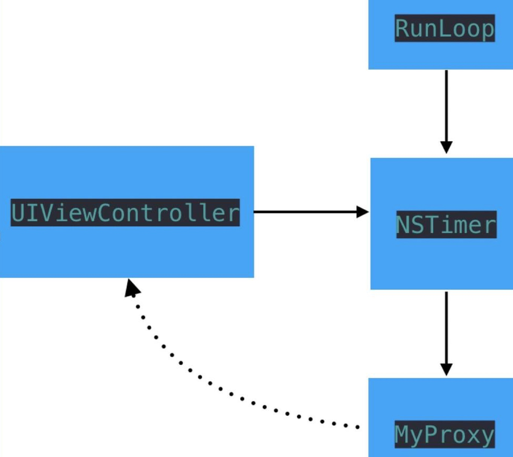
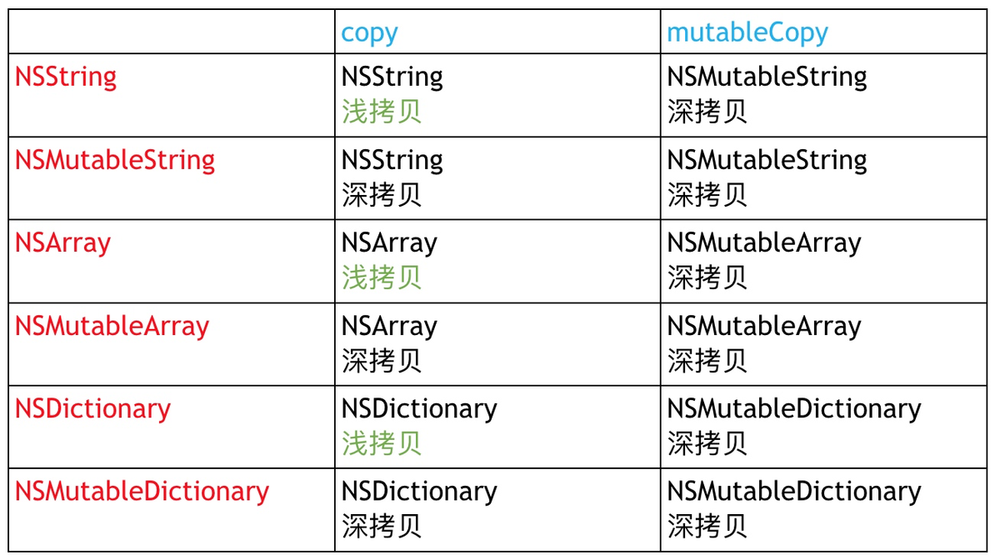
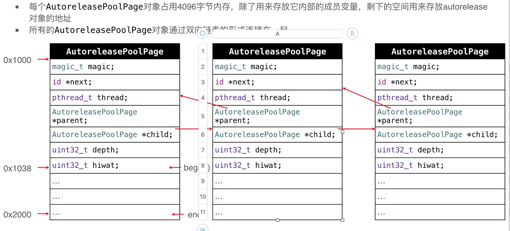

#### 1.什么是内存泄漏?

- 内存泄漏指动态分配内存的对象在使用完后没有被系统回收内存,导致对象始终占有着内存,属于内存管理出错, (例如一个对象或者变量使用完成后没有释放,这个对象一直占用着内存)，一次内存泄露危害可以忽略，但内存泄露堆积后果很严重，无论多少内存,迟早会被占光。

#### 2. 什么是僵尸对象?

- 已经被销毁的对象(不能再使用的对象),内存已经被回收的对象。一个引用计数器为0对象被释放后就变为了僵尸对象;

#### 3. 野指针

- 野指针又叫做'悬挂指针', 野指针出现的原因是因为指针没有赋值,或者指针指向的对象已经释放了, 比如指向僵尸对象;野指针可能会指向一块垃圾内存,给野指针发送消息会导致程序崩溃
    比如:

    

    ```csharp
    NSObject *obj = [NSObject new];
    [obj release]; // obj 指向的内存地址已经释放了,
    obj 如果再去访问的话就是野指针错误了.
    野指针错误形式在Xcode中通常表现为：Thread 1：EXC_BAD_ACCESS，因为你访问了一块已经不属于你的内存。
    ```

#### 4. 什么是空指针?

- 空指针不同于野指针,他是一个没有指向任何内存的指针,空指针是有效指针,值为`nil,NULL,Nil,0`等,给空指针发送消息不会报错,不会响应消息;

#### 5. OC对象的内存管理机制?

在iOS中，使用引用计数来管理OC对象的内存

- 一个新创建的OC对象引用计数默认是1，当引用计数减为0，OC对象就会销毁，释放其占用的内存空间
- 调用`retain`会让OC对象的引用计数+1，调用`release`会让OC对象的引用计数-1

内存管理的经验总结

- 当调用alloc、new、copy、mutableCopy方法返回了一个对象，在不需要这个对象时，要调用release或者autorelease来释放它
- 想拥有某个对象，就让它的引用计数+1；不想再拥有某个对象，就让它的引用计数-1

可以通过以下私有函数来查看自动释放池的情况

- `extern void _objc_autoreleasePoolPrint(void);`

#### 6. OC中有GC垃圾回收机制吗?,iPhone上GC吗?

- 垃圾回收(GC),就是程序中用于处理废弃不用的内存对象的机制,防止内存泄露
- OC本身是支持垃圾回头得,不过只支持MAC OSX平台, iOS 平台不支持

#### 7.在OC中与 Alloc 语义相反的是 release 还是 dealloc?

- alloc 与 dealloc 语义相反,alloc 是创建变量,dealloc是释放变量
- retain 与 release 语义相反, retain 保留一个对象,引用计数器+1, release 使引用计数器 -1;

#### 8.什么是内存溢出?

- 当程序在申请内存时，没有足够的内存空间供其使用，出现out of memory;比如申请了一个int,但给它存了long才能存下的数，那就是内存溢出。

#### 9.内存区域分布

在iOS开发过程中，为了合理的分配有限的内存空间，将内存区域分为五个区，由低地址向高地址分类分别是：代码区、常量区、全局静态区、堆、栈。

- 代码段 -- 程序编译产生的二进制的数据
- 常量区 -- 存储常量数据，通常程序结束后由系统自动释放
- 全局静态区 -- 全局区又可分为未初始化全局区：.bss段和初始化全局区：data段。全局变量和静态变量的存储是放在一块的，初始化的全局变量和静态变量在一块区域， 未初始化的全局变量和未初始化的静态变量在相邻的另一块区域，在程序结束后有系统释放。
- 堆（heap) -- 程序运行过程中,动态分配的内存
- 栈（stack） -- 存放局部变量，临时变量

#### 10.堆区和栈取的区别

- 按管理方式分
    - 对于栈来讲，是由系统编译器自动管理，不需要程序员手动管理
    - 对于堆来讲，释放工作由程序员手动管理，不及时回收容易产生内存泄露
- 按分配方式分
    - 堆是动态分配和回收内存的，没有静态分配的堆
    - 栈有两种分配方式：静态分配和动态分配
    - 静态分配是系统编译器完成的，比如局部变量的分配
    - 动态分配是有alloc函数进行分配的，但是栈的动态分配和堆是不同的，它的动 态分配也由系统编译器进行释放，不需要程序员手动管理

#### 11.怎么保证多人开发进行内存泄露的检查.

1. 使用Analyze进行代码的静态分析
2. 为避免不必要的麻烦, 多人开发时尽量使用ARC
3. 使用leaks 进行内存泄漏检测
4. 使用一些三方工具

#### 12.block在ARC中和MRC中的用法有什么区别,需要注意什么?

1. 对于没有引用外部变量的Block，无论在ARC还是非ARC下，类型都是 **NSGlobalBlock**，这种类型的block可以理解成一种全局的block，不 需要考虑作用域问题。同时，对他进行Copy或者Retain操作也是无效的
2. 都需要应注意避免循环引用,ARC 下使用__weak 来解决,MRC下使用__Block 来解决;

#### 13.OC 如何对内存管理解决方法?

Objective-C的内存管理主要有三种方式 自动内存管理、手动内存管理、自动释放池。

1. 自动内存计数
2. 手动内存计数:
3. 自动释放池:

#### 14.ARC 都帮我们做了什么？

- LLVM + Runtime 会为我们代码自动插入 retain 和 release 以及 autorelease等代码,不需要我们手动管理

#### 15.weak指针的实现原理

- Runtime维护了一个weak表，用于存储指向某个对象的所有weak指针。weak表其实是一个hash（哈希）表，Key是所指对象的地址，Value是weak指针的地址（这个地址的值是所指对象的地址）数组。
- runtime对注册的类， 会进行布局，对于weak对象会放入一个hash表中。 用weak指向的对象内存地址作为key，当此对象的引用计数为0的时候会dealloc，假如weak指向的对象内存地址是a，那么就会以a为键， 在这个weak表中搜索，找到所有以a为键的weak对象，从而设置为nil。

#### 16.方法里有局部对象，出了方法后会立即释放吗

- 如果是普通的 局部对象 会立即释放
- 如果是放在了 autoreleasePool 自动释放池,在 runloop 迭代结束的时候释放

#### 17.MRC情况下怎么做单例模式

创建单例设计模式的基本步骤 : ·

1. 声明一个单件对象的静态实例,并初始化为nil。
2. 创建一个类的类工厂方法,当且仅当这个类的实例为nil时生成一个该类 的实例
3. 实现NScopying协议, 覆盖allocWithZone:方法,确保用户在直接分配和 初始化对象时,不会产 生另一个对象。
4. 覆盖release、autorelease、retain、retainCount方法, 以此确保单例的 状态。
5. 在多线程的环境中,注意使用@synchronized关键字或GCD,确保静态实 例被正确的创建和初始化。

#### 18.非OC对象如何管理内存？

- 非OC对象，其需要手动执行释放操作例：CGImageRelease(ref)，否则会造成大量的内存泄漏导致程序崩溃。其他的对于CoreFoundation框架下的某些对象或变量需要手动释放、C语言代码中的malloc等需要对应free。

#### 19. CADisplayLink、NSTimer会出现的问题,以及解决办法?

问题:

1. CADisplayLink、NSTimer会对target产生强引用，如果target又对它们产生强引用，那么就会引发循环引用
2. CADisplayLink、NSTimer都是基于 runloop 实现的.runloop 会对 CADisplayLink、NSTimer进行强引用, CADisplayLink、NSTimer又 会对 target 进行引用,造成循环引用

- 解决方案1.使用block


```objectivec
// 内部使用 WeakSelf,并在视图消失前,关闭定时器
__weak __typeof(self)weakSelf = self;
NSTimer * timer = [NSTimer timerWithTimeInterval:1 repeats:YES block:^(NSTimer * _Nonnull timer) {
    NSLog(@"timer");
}];
self.timer= timer;
[[NSRunLoop currentRunLoop]addTimer:timer forMode:NSRunLoopCommonModes];
```

- 解决方案2.使用代理对象（NSProxy）



image.png


```oc
.h
// 解决循环引用问题
@interface MyProxy : NSProxy
- (instancetype)initWithObjc:(id)objc;
+ (instancetype)proxyWithObjc:(id)objc;
.m
@interface MyProxy()
@property(nonatomic,weak) id objc;
@end

@implementation MyProxy
- (instancetype)initWithObjc:(id)objc{
    self.objc = objc;
    return self;
}
+ (instancetype)proxyWithObjc:(id)objc{
    return [[self alloc] initWithObjc:objc];
}
- (NSMethodSignature *)methodSignatureForSelector:(SEL)aSelector {
    return [self.objc methodSignatureForSelector:aSelector];
}
- (void)forwardInvocation:(NSInvocation *)invocation {
    if ([self.objc respondsToSelector:invocation.selector]) {
        [invocation invokeWithTarget:self.objc];
    }
}
```

使用方法:


```objectivec
NSTimer * timer = [NSTimer timerWithTimeInterval:1
                                          target:[TimerProxy proxyWithTarget:self]
                                        selector:@selector(test1)
                                        userInfo:nil
                                         repeats:YES];
self.timer = timer;
[[NSRunLoop currentRunLoop] addTimer:timer forMode:NSRunLoopCommonModes];
```

#### 20.什么是Tagged Pointer?

- 从64bit开始，iOS引入了Tagged Pointer技术，用于优化NSNumber、NSDate、NSString等小对象的存储
- 在没有使用Tagged Pointer之前， NSNumber等对象需要动态分配内存、维护引用计数等，NSNumber指针存储的是堆中NSNumber对象的地址值
- 使用Tagged Pointer之后，NSNumber指针里面存储的数据变成了：Tag + Data，也就是将数据直接存储在了指针中
- 当指针不够存储数据时，才会使用动态分配内存的方式来存储数据

#### 21.copy和mutableCopy区别



image.png

#### 22. 内存泄漏可能会出现的几种原因？

- 第一种可能：第三方框架不当使用；
- 第二种可能：block循环引用；
- 第三种可能：delegate循环引用；
- 第四种可能：NSTimer循环引用
- 第五种可能：非OC对象内存处理
- 第六种可能：地图类处理
- 第七种可能：大次数循环内存暴涨

#### 23. ARC下什么样的对象由 Autoreleasepool 管理

- 当使用alloc/new/copy/mutableCopy开始的方法进行初始化时，会生成并持有对象(也就是不需要pool管理，系统会自动的帮他在合适位置release),不需要pool进行管理
- 一般类方法创建的对象需要使用Autoreleasepool进管理

#### 24. 如何实现AutoreleasePool?

- AutoreleasePool(自动释放池)其实并没有自身的结构,他是基于多个AutoreleasePoolPage(一个C++类)以双向链表组合起来的结构; 可以通过 push操作添加对象,pod 操作弹出对象,以及通过 release 操作释放对象;

#### 25. AutoreleasePoolPage的结构?以及如何 push 和 pod 的?



image.png

- 调用push方法会将一个POOL_BOUNDARY入栈，并且返回其存放的内存地址
- 调用pop方法时传入一个POOL_BOUNDARY的内存地址，会从最后一个入栈的对象开始发送release消息，直到遇到这个POOL_BOUNDARY
- id *next指向了下一个能存放autorelease对象地址的区域

#### 26.Autoreleasepool 与 Runloop 的关系

- 主线程默认为我们开启 Runloop，Runloop 会自动帮我们创建Autoreleasepool，并进行Push、Pop 等操作来进行内存管理

iOS在主线程的Runloop中注册了2个Observer

- 第1个Observer监听了`kCFRunLoopEntry`事件，会调用`objc_autoreleasePoolPush()`
- 第2个Observer 监听了`kCFRunLoopBeforeWaiting`事件，会调用`objc_autoreleasePoolPop()、objc_autoreleasePoolPush()`监听了`kCFRunLoopBeforeExit`事件，会调用`objc_autoreleasePoolPop()`

#### 27.子线程默认不会开启 Runloop，那出现 Autorelease 对象如何处理？不手动处理会内存泄漏吗？

- 在子线程你创建了 Pool 的话，产生的 Autorelease 对象就会交给 pool 去管理。如果你没有创建 Pool ，但是产生了 Autorelease 对象，就会调用 autoreleaseNoPage 方法。在这个方法中，会自动帮你创建一个 hotpage（hotPage 可以理解为当前正在使用的 AutoreleasePoolPage，如果你还是不理解，可以先看看 Autoreleasepool 的源代码，再来看这个问题 ），并调用 page->add(obj)将对象添加到 AutoreleasePoolPage 的栈中，也就是说你不进行手动的内存管理，也不会内存泄漏啦！StackOverFlow 的作者也说道，这个是 OS X 10.9+和 iOS 7+ 才加入的特性。

#### 28.以下代码会有什么问题吗?


```kotlin
Person *p = [[[[Person alloc]init] autorelease] autorelease];
```

- 以上代码会导致程序崩溃,连续调用2次 autorelease,对象被加入自动释放吃2次, 在释放时候,此一次释放对象就已经销毁了,第二次再释放就会崩溃;

#### 29.以下代码运行会有是问题?


```objectivec
for (int i= 0; i< 1000000; i++) {
      NSString * str = [NSString stringWithFormat:@"abcdefghijklmn1234566!@#$"];
}
    
for (int i= 0; i< 1000000; i++) {
       NSString * str = [NSString stringWithFormat:@"abc!"];
 }
```

- 第一个内存会暴涨,str对象会不停的创建,由于是静态方法,会加入到自动释放池,会延迟释放,造成内存暴涨,使用@autoreleasepool 解决
- 第二个内存固定,会使用 Tagged Pointer 将值存在str 变量地址中, 存在栈空间地址中, 出了作用域会自动销毁


作者：Leon_520
链接：https://www.jianshu.com/p/713106afd7ef
来源：简书
著作权归作者所有。商业转载请联系作者获得授权，非商业转载请注明出处。