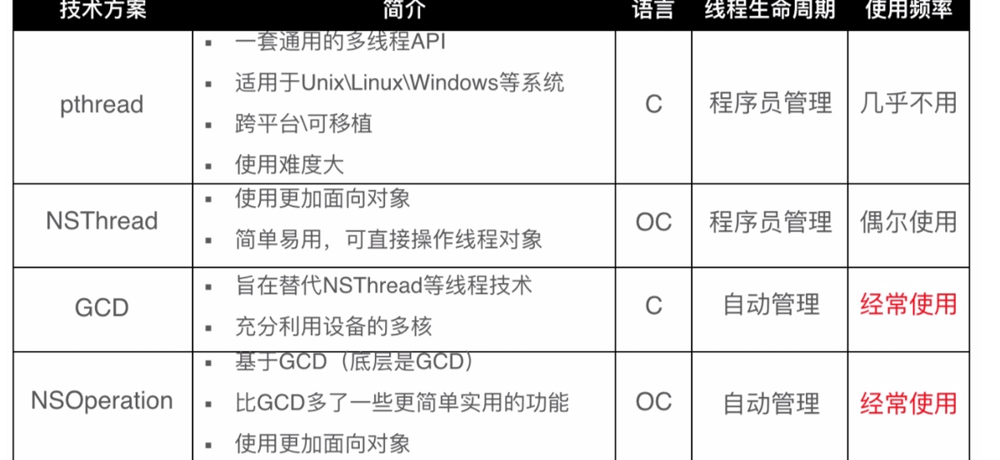

#### 1.什么是多线程?

- `多线程`是指实现多个线程并发执行的技术,进而提升整体处理性能。
- 同一时间,CPU 只能处理一条线程,多线程并发执行,其实是 CPU 快速的在多条线程之间调度(切换)如果 CPU 调度线程的时间足够快, 就造成了多线程并发执行的假象
    - 主线程的栈区 空间大小为1M,非常非常宝贵
    - 子线程的栈区 空间大小为512K内存空间
- 优势
    充分发挥多核处理器的优势，将不同线程任务分配给不同的处理器，真正进入“并行计算”状态
- 弊端
    新线程会消耗内存控件和cpu时间，线程太多会降低系统运行性能。

#### 2.进程和线程区别?

- 进程：正在运行的程序，负责程序的内存分配，每一个进程都有自己独立的虚拟内存空间。（一个程序运行的动态过程）
- 线程：线程是进程中一个独立执行的路径（控制单元）一个进程至少包含一条线程，即主线程可以将耗时的执行路径（如网络请求）放在其他线程中执行。
- 进程和线程的比较
    - 线程是 CPU 调用的最小单位
    - 进程是 CPU 分配资源和调度的单位
    - 一个程序可以对应多个进程,一个进程中可有多个线程,但至少要有一条线程,
    - 同一个进程内的线程共享进程资源

#### 3.线程间怎么通信?

- 线程间的通信体现: 一个线程传递数据给另一个线程,
- 在一个线程中执行完特定的任务后，转到另一个线程继续执行任务。

#### 4.iOS的多线程方案有哪几种？



image.png

#### 5. 什么是GCD?

`GCD(Grand Central Dispatch)`, 又叫做大中央调度, 它对线程操作进行了封装,加入了很多新的特性,内部进行了效率优化,提供了简洁的`C语言接口`, 使用更加高效,也是苹果推荐的使用方式.

#### 6.GCD 的队列类型?

GCD的队列可以分为2大类型

- 并发队列（`Concurrent Dispatch Queue`）
    可以让多个任务并发（同时）执行（自动开启多个线程同时执行任务）
    并发功能只有在异步（`dispatch_async`）函数下才有效
- 串行队列（`Serial Dispatch Queue`）
    让任务一个接着一个地执行（一个任务执行完毕后，再执行下一个任务）,按照FIFO顺序执行.

#### 7.什么是同步和异步任务派发(synchronous和asynchronous)?

GCD多线程经常会使用 `dispatch_sync`和`dispatch_async`函数向指定队列添加任务,分别是`同步和异步`

- 同步指阻塞当前线程,既要等待添加的耗时任务块Block完成后,函数才能返回,后面的代码才能继续执行
- 异步指将任务添加到队列后,函数立即返回,后面的代码不用等待添加的任务完成后即可执行,异步提交无法确定任务执行顺序

#### 8.dispatch_after使用?

通过该函数可以让提交的任务在指定时间后开始执行,也就是延迟执行;


```objectivec
dispatch_after(dispatch_time(DISPATCH_TIME_NOW, (int64_t)(10 * NSEC_PER_SEC)), dispatch_get_main_queue(), ^{
        NSLog(@"10秒后开始执行")
    });
```

#### 9.dispatch_group_t (组调度)的使用?

组调度可以实现等待一组操都作完成后执行后续任务.


```csharp
dispatch_group_t group = dispatch_group_create();
dispatch_group_async(group, dispatch_get_global_queue(DISPATCH_QUEUE_PRIORITY_DEFAULT, 0), ^{
    //请求1
});
dispatch_group_async(group, dispatch_get_global_queue(DISPATCH_QUEUE_PRIORITY_DEFAULT, 0), ^{
    //请求2
});
dispatch_group_async(group, dispatch_get_global_queue(DISPATCH_QUEUE_PRIORITY_DEFAULT, 0), ^{
    //请求3
});
dispatch_group_notify(group, dispatch_get_main_queue(), ^{
    //界面刷新
    NSLog(@"任务均完成，刷新界面");
});
```

#### 10.dispatch_semaphore (信号量)如何使用?

- 用于控制最大并发数
- 可以防止资源抢夺

与他相关的共有三个函数，分别是


```cpp
dispatch_semaphore_create，  // 创建最大并发数
dispatch_semaphore_wait。    // -1 开始执行 (0则等待)
dispatch_semaphore_signal，  // +1 
```

#### 11.什么是NSOperation?

NSOperation是基于GCD的上封装,将线程封装成要执行的操作,不需要管理线程的生命周期和同步,比GCD可控性更强

例如:
可以加入操作依赖控制执行顺序,设置操作队列最大并发数,取消操作等

#### 12. NSOperation如何实现操作依赖?

通过任务间添加依赖，可以为任务设置执行的先后顺序。接下来通过一个案例来展示设置依赖的效果。


```objectivec
NSOperationQueue *queue=[[NSOperationQueue alloc] init];
//创建操作
NSBlockOperation *operation1=[NSBlockOperation blockOperationWithBlock:^(){
    NSLog(@"执行第1次操作，线程：%@",[NSThread currentThread]);
}];
NSBlockOperation *operation2=[NSBlockOperation blockOperationWithBlock:^(){
    NSLog(@"执行第2次操作，线程：%@",[NSThread currentThread]);
}];
NSBlockOperation *operation3=[NSBlockOperation blockOperationWithBlock:^(){
    NSLog(@"执行第3次操作，线程：%@",[NSThread currentThread]);
}];
//添加依赖
[operation1 addDependency:operation2];
[operation2 addDependency:operation3];
//将操作添加到队列中去
[queue addOperation:operation1];
[queue addOperation:operation2];
[queue addOperation:operation3];
```

#### 13.是否可以把比较耗时的操作放在 NSNotification中?

- 如果在异步线程发的通知，那么可以执行比较耗时的操作;
- 如果在主线程发的通知，那么就不可以执行比较耗时的操作

#### 14.说几个你在工作中使用到的线程安全的例子?

- UIKit(必须在主线程)
- FMDBDataBaseQueue(串行队列)
- 等等..

#### 15.dispatch_barrier_(a)sync使用?

- 一个dispatch barrier 允许在一个并发队列中创建一个同步点。当在并发队列中遇到一个barrier, 他会延迟执行barrier的block,等待所有在barrier之前提交的blocks执行结束。 这时，barrier block自己开始执行。 之后， 队列继续正常的执行操作。

#### 16. dispatch_set_target_queue 使用?


```cpp
dispatch_set_target_queue(dispatch_object_t object, dispatch_queue_t queue);
```

dispatch_set_target_queue 函数有两个作用：第一，变更队列的执行优先级；第二，目标队列可以成为原队列的执行阶层。

- 第一个参数是要执行变更的队列（不能指定主队列和全局队列）
- 第二个参数是目标队列（指定全局队列）
    主线程是相对于什么而言的

#### 17.在项目什么时候选择使用 GCD，什么时候选 择 NSOperation?

- 项目中使用 NSOperation 的优点是 NSOperation 是对线程的高度抽象，在项目中使 用它，会使项目的程序结构更好，子类化 NSOperation 的设计思路，是具有面向对 象的优点(复用、封装)，使得实现是多线程支持，而接口简单，建议在复杂项目中 使用。
- 项目中使用 GCD 的优点是 GCD 本身非常简单、易用，对于不复杂的多线程操 作，会节省代码量，而 Block 参数的使用，会是代码更为易读，建议在简单项目中 使用。

#### 18.说一下 OperationQueue 和 GCD 的区别，以及各自的优势

1. GCD是纯C语⾔言的API，NSOperationQueue是基于GCD的OC版本封装
2. GCD只⽀支持FIFO的队列列，NSOperationQueue可以很⽅方便便地调整执⾏行行顺 序、设 置最⼤大并发数量量
3. NSOperationQueue可以在轻松在Operation间设置依赖关系，⽽而GCD 需要写很 多的代码才能实现
4. NSOperationQueue⽀支持KVO，可以监测operation是否正在执⾏行行 (isExecuted)、 是否结束(isFinished)，是否取消(isCanceld)
5. GCD的执⾏行行速度⽐比NSOperationQueue快 任务之间不不太互相依赖:GCD 任务之间 有依赖\或者要监听任务的执⾏行行情况:NSOperationQueue

#### 19.GCD如何取消线程?

GCD目前有两种方式可以取消线程:

1.`dispatch_block_cancel`类似NSOperation一样，可以取消还未执行的线程。但是没办法做到取消一个正在执行的线程。


```cpp
dispatch_queue_t queue = dispatch_get_global_queue(0, 0);
dispatch_block_t block1 = dispatch_block_create(0, ^{
    NSLog(@"block1");
});
dispatch_block_t block2 = dispatch_block_create(0, ^{
    NSLog(@"block2");
});
    
dispatch_block_t block3 = dispatch_block_create(0, ^{
    NSLog(@"block3");
});
    
dispatch_async(queue, block1);
dispatch_async(queue, block2);
dispatch_async(queue, block3);
dispatch_block_cancel(block3); // 取消 block3
```

2.使用`临时变量+return` 方式取消 正在执行的Block


```objectivec
__block BOOL gcdFlag= NO; // 临时变量
dispatch_async(dispatch_get_global_queue(0, 0), ^{
    for (long i=0; i<1000; i++) {
        NSLog(@"正在执行第i次:%ld",i);
        sleep(1);
        if (gcdFlag==YES) { // 判断并终止
            NSLog(@"终止");
            return ;
        }
    };
});
dispatch_after(dispatch_time(DISPATCH_TIME_NOW, (int64_t)(10 * NSEC_PER_SEC)), dispatch_get_main_queue(), ^{
                   NSLog(@"我要停止啦");
                   gcdFlag = YES;
               });
```

#### 20.NSOperation取消线程方式?

1.通过 cancel 取消未执行的单个操作


```objectivec
NSOperationQueue *queue1 = [[NSOperationQueue alloc]init];
NSBlockOperation *block1 = [NSBlockOperation blockOperationWithBlock:^{
    NSLog(@"block11");
}];
NSBlockOperation *block2 = [NSBlockOperation blockOperationWithBlock:^{
    NSLog(@"block22");
}];
NSBlockOperation *block3 = [NSBlockOperation blockOperationWithBlock:^{
    NSLog(@"block33");
}];
[block3 cancel];
[queue1 addOperations:@[block1,block2,block3] waitUntilFinished:YES];
```

2.移除队列里面所有的操作，但正在执行的操作无法移除


```csharp
[queue1 cancelAllOperations];
```

3.挂起队列，使队列任务不再执行，但正在执行的操作无法挂起


```objectivec
queue1.suspended = YES;
```

4.我们可以自定义NSOperation，实现取消正在执行的操作。其实就是拦截main方法。


```undefined
 main方法：
 1、任何操作在执行时，首先会调用start方法，start方法会更新操作的状态（过滤操作,如过滤掉处于“取消”状态的操作）。
 2、经start方法过滤后，只有正常可执行的操作，就会调用main方法。
 3、重写操作的入口方法(main)，就可以在这个方法里面指定操作执行的任务。
 4、main方法默认是在子线程异步执行的。
```

#### 21. 什么是线程安全?

- 1块资源可能会被多个线程共享，也就是多个线程可能会访问同一块资源
- 比如多个线程访问同一个对象、同一个变量、同一个文件
- 当多个线程访问同一块资源时，很容易引发数据错乱和数据安全问题

#### 22.线程安全的处理手段有哪些？

- 加锁
- 同步执行

#### 23.如何理解GCD死锁?

- 所谓死锁.通常是指2个操作相互等待对方完成,造成死循环,于是2个操作都无法进行,就产生了死锁;

#### 24.自旋锁和互斥锁的是什么?

- 自旋锁会忙等: 所谓忙等，即在访问被锁资源时，调用者线程不会休眠，而是不停循环在那里，直到被锁资源释放锁。
- 互斥锁会休眠: 所谓休眠，即在访问被锁资源时，调用者线程会休眠，此时cpu可以调度其他线程工作。直到被锁资源释放锁。此时会唤醒休眠线程。

#### 25.OC你了解的锁有哪些？

- os_unfair_lock ios10 开始
- OSSpanLock ios10 废弃
- dispatch_semaphore 建议使用,性能也比较好
- dispatch_mutex
- dispatch_queue 串行
- NSLock 对 mutex 封装
- @synchronized 性能最差

#### 26：自旋和互斥什么情况下使用？

什么情况使用自旋锁比较划算？

- 预计线程等待锁的时间很短
- 加锁的代码（临界区）经常被调用，但竞争情况很少发生
- CPU资源不紧张
- 多核处理器

什么情况使用互斥锁比较划算？

- 预计线程等待锁的时间较长
- 单核处理器
- 临界区有IO操作
- 临界区代码复杂或者循环量大
- 临界区竞争非常激烈

#### 27.代码分析一,此函数耗时? 输出结果


```objectivec
dispatch_queue_t queue = dispatch_queue_create("test", nil);
dispatch_async(queue, ^{
    NSLog(@"1");
    sleep(1);
});
dispatch_async(queue, ^{
    NSLog(@"2");
    sleep(1);
});
dispatch_sync(queue, ^{
    NSLog(@"3");
    sleep(1);
});
此函数耗时?: 3秒
此函数输出?: 123
```

- 串行队列异步执行会开新线程,同步执行不会开线程,在一个串行队列了,则是按照顺序执行 耗时3秒 ,打印123;
- 并发: 任务以FIFO从序列中移除，然后并发运行，可以按照任何顺序完成。它会自动开启多个线程同时执行任务
- 串行: 任务以FIFO从序列中一个一个执行。一次只调度一个任务，队列中的任务一个接着一个地执行（一个任务执行完毕后，再执行下一个任务）而且只会开启一条线程

#### 28.代码分析二,打印结果


```objectivec
dispatch_queue_t queue = dispatch_get_global_queue(0, 0);
dispatch_async(queue, ^{
    NSLog(@"1");
    [self performSelector:@selector(test) withObject:nil afterDelay:0];
    NSLog(@"3");
});

- (void)test{
    NSLog(@"2");
}
```

打印 1,3
performSelector after 是基于 timer 定制器,定时器又是基于 runloop 实现的;任务2在子线程中,子线程默认 runloop 是不开启的,所以不执行2

#### 29.请问下面代码的打印结果是什么？


```objectivec
- (void)test{
    NSLog(@"2");
}

- (void)touchesBegan:(NSSet<UITouch *> *)touches withEvent:(UIEvent *)event{
    NSThread *thread = [[NSThread alloc]initWithBlock:^{
        NSLog(@"1");
    }];
    [thread start];
    [self performSelector:@selector(test) onThread:thread withObject:nil waitUntilDone:YES];
}
```

打印1

- start 执行完,线程就销毁了.任务 test 没法执行了


作者：Leon_520
链接：https://www.jianshu.com/p/a937fd308669
来源：简书
著作权归作者所有。商业转载请联系作者获得授权，非商业转载请注明出处。